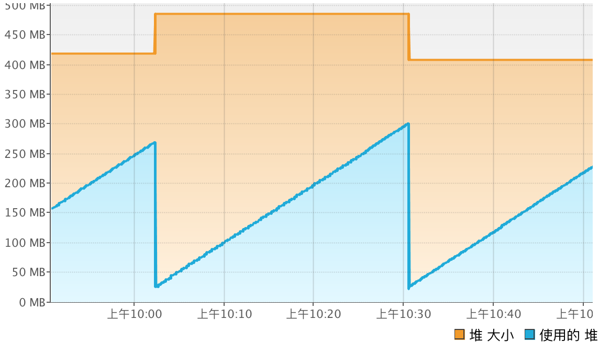
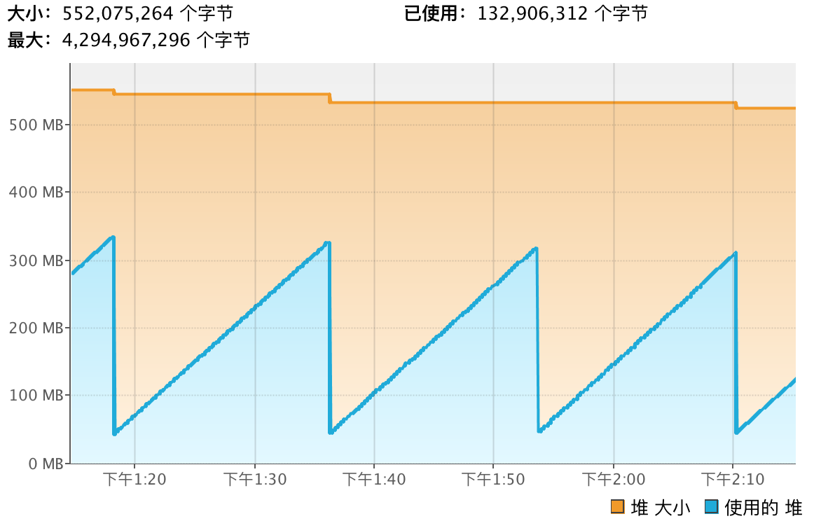
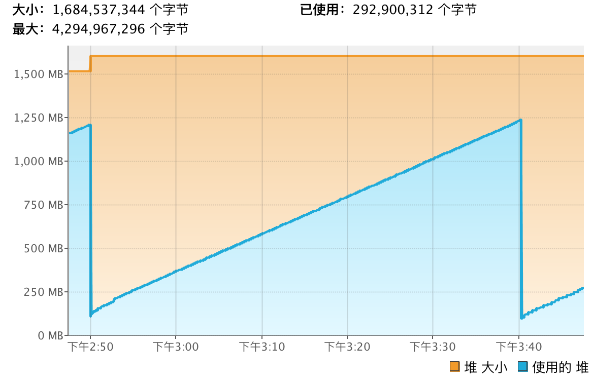

##  分析

- 起一个单纯的spring boot的web项目，容器为undertow
  
  自动GC后使用的内存约为28M，随着运行产生一些运行对象，最高达到约300M
  
- 起一个只有一个接口的spring cloud euraka项目，容器为undertow
  
  自动GC后使用的内存约为49M，最高达到约344M，每隔约17分钟执行一次垃圾回收
  
- hap-user-service服务，不添加JVM参数
  
  自动GC后使用的内存约为115M，最高达到约1.4G，每隔约50分钟执行一次垃圾回收。
  本机内存为16G，JVM自动给该服务分配伊甸区内存为1.231G
  
- hap-user-service服务，添加JVM参数-server -XX:+TieredCompilation -Xms768m -Xmx768m -Xss256k -XX:+UseG1GC
  
  -Xmx768m设置了最大堆内存为768m，伊甸区为452m，
  自动GC后使用的内存约为102M，最高达到约541M，每隔约18分钟执行一次垃圾回收。

## 优化
> 由上分析可知，绝大数内存占用源于业务代码本身，而spring boot本身内存占用只占少部分。就算内存占用较多的hap-user-service在GC后内存也只有115M，但运行时会产生大量的临时对象，造成伊甸区内存增大。优化方式主要分为spring boot优化，业务代码优化，JVM优化三种方式。

### spring boot本身的优化

   1. [使用udertow替代tomcat](https://alexecollins.com/spring-boot-performance/)

        > springboot使用tomcat大约110m堆内存，16线程，使用udertow约90m堆内存约13个线程。
   2. [关闭SpringBootApplication自动配置](https://dzone.com/articles/spring-boot-memory-performance)
   
         > Spring Boot自动配置额外消耗大约为1MB堆和4MB非堆。
      
### 业务代码优化
   1. 将过期引用置为null
   
      > 当确定一个对象不在使用之后，尤其是大对象应该将其设置成null，这样可以加快对象的回收。大部分时，方法局部引用变量所引用的对象 会随着方法结束而变成垃圾，因此，大部分时候程序无需将局部，引用变量显式设为null。
   2. 正确并及时在finally里面关闭资源
      > 在finally里面回收，可以保证资源的正确关闭。否则，可能出现资源没有正确关闭的情况，如出现异常，这样可能导致资源泄露的问题。
   3. 尽量缓存经常使用的对象
      > 尽可能使用经常使用的对象进行缓存，一般使用数组或者HashMap这些容器进行缓存。这种方式缓存的时候可能导致系统中占用过多的缓存，使得系统性能下降。所以，可以使用一些第三方缓存项目，如EhCache和OsCache，这些框架采用了一些缓存算法，如FIFO（先进先出算法）、LRU（Least Recenly Used 最近最少使用算法）等等。
        在自己实现缓存对象后可能出现一个问题，如使用HashMap缓存对象，随着缓存的对象增多，可能出现内存溢出的问题，这个时候可以采用软引用来避免OOM的问题。而采用缓存算法可以解决性能问题。在ImageLoader框架里面既使用了软引用技术，又使用了相关缓存算法。
   4. 充分利用单例机制
      > 单例可以减少对资源的加载，缩短运行的时间，提高系统效率，将频繁使用类声明为单例可以减少GC。
   5. 尽量使用基本数据类型代替对象
      > 基本类型数据产生和处理都在栈中处理，包装类型是对象，是在堆中产生实例。在集合类对象，有对象方面需要的处理适用包装类型，其他的处理提倡使用基本类型。
   6. 尽量使用局部变量
      > 调用方法时传递的参数以及在调用中创建的临时变量都保存在栈（Stack）中，速度较快。其他变量，如静态变量、实例变量等，都在堆（Heap）中创建，速度较慢。
   7. 尽量避免使用二维数组
      > 二维数据占用的内存空间比一维数组多得多，大概10倍以上。
   8. 尽量避免使用split
      > 除非是必须的，否则应该避免使用split，split由于支持正则表达式，所以效率比较低，如果是频繁的几十，几百万的调用将会耗费大量资源，如果确实需 要频繁的调用split，可以考虑使用apache的. StringUtils.split(string,char)，频繁split的可以缓存结果。
   9. 慎用异常
      > 如果您创建一个Exception ，就得付出不小的代价。好在捕获异常开销不大,您甚至可以随意地抛出异常，而不用花费很大的代价
   10. 尽量使用StringBuilder和StringBuffer进行字符串连接
   11. 尽量使用final修饰符
   12. 变量只有在用到它的时候才定义和实例
   13. 避免过深的类层次结构和过深的方法调用，这两者都是非常占用内存的
  
### JVM优化
   1. 使用32位JVM
   
      	> 相比32位虚拟机64位JVM需要多出30-50%的内存，而且构建更大的堆意味着GC要做更多的工作去清理无用的对象。但是32位linux最大可用内存约为2G，特定linux内核可达到3G，如果程序所需内存不大于2G，可以考虑32位JVM。
   2. -server
      > 以server模式运行时
   3. -XX:+TieredCompilation
      > 启用分层编译，即在系统执行初期，执行频率比较高的代码先被c1编译器编译，以便尽快进入编译执行，然后随着时间的推移，执行频率较高的代码再被c2编译器编译，以达到最高的性能。
   4. -Xmx768m -Xms768m
      > -Xmx为jvm运行过程中分配的最大内存，-Xms为jvm启动时分配的内存，可以设置与-Xmx相同，以避免每次垃圾回收完成后JVM重新分配内存。
   5. -Xmn288m
      > 设置年轻代大小为2G。此值对系统性能影响较大，Sun官方推荐配置为整个堆的3/8。
   6. -Xss512k
      > 设置每个线程的堆栈大小,JDK5.0以后每个线程堆栈大小为1M,在相同物理内存下，减小这个值能生成更多的线程。
   7. -XX:NewRatio=2
      > 设置年轻代（包括Eden和两个Survivor区）与年老代的比值。设置年轻代（包括Eden和两个Survivor区）与年老代的比值（除去持久代）。设置为2，则年轻代与年老代所占比值为1：2，年轻代占整个堆栈的1/3
   8. -XX:SurvivorRatio=4
      > 设置年轻代中Eden区与Survivor区的大小比值。设置为4，则两个Survivor区与一个Eden区的比值为2:4，一个Survivor区占整个年轻代的1/6.
   9. -XX:+AggressiveOpts
      > 启用JVM开发团队最新的调优成果。例如编译优化，偏向锁，并行年老代收集等。
   10. -XX:+UseG1GC -XX:+UseStringDeduplication
      > 启用G1垃圾回收器, 在使用G1垃圾回收器时可以通过设置-XX:+UseStringDeduplication删除重复的字符串，只保留一个char[]来优化堆内存。