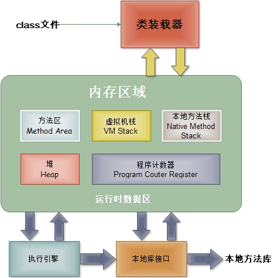
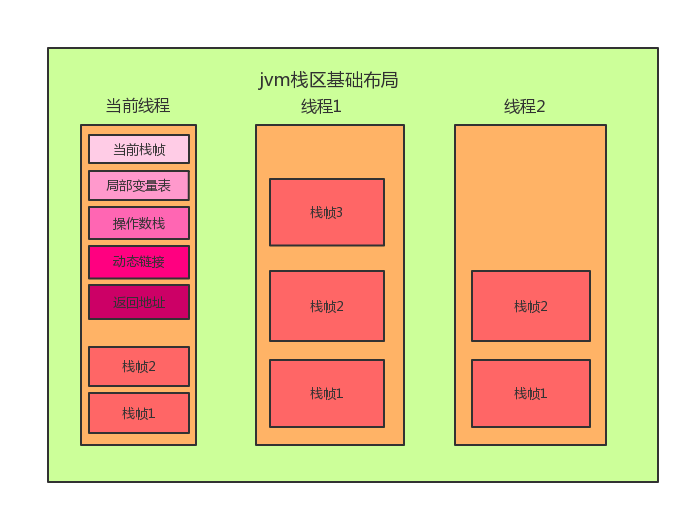
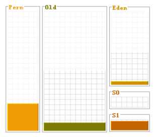

## JVM内存模型



#### JVM内存模型大致分为五部分，分别是：

1. 程序计数器
2. 虚拟机栈
3. 本地方法栈
4. 堆
5. 方法区

#### 1. java虚拟机栈



```
虚拟机栈是由一个个栈帧组成，而每个栈帧中都拥有：局部变量表、操作数栈、动态链接、方法出口信息。 

是线程私有的，生命周期和线程一样，每个方法被执行的时候会产生一个栈帧,用于存储局部变量表、动态链接、操作数、方法出口等信息。
方法的执行过程就是栈帧在JVM中出栈和入栈的过程,栈为后进先出（LIFO）栈。

局部变量表中用于方法间参数传递，以及方法执行过程中存储基础数据类型的值和对象的引用。
存放的是各种基本数据类型，如boolean、byte、char、等8种，及引用类型（存放的是指向各个对象的内存地址），
它由若干个Slot组成，长度由编译期决定，单个Slot可以存储一个类型为boolean,byte,char,short,float,reference和returnAddress的数据，
两个Slot可以存储一个类型为long或double的数据。
内存空间可以在编译期间就确定，运行期不在改变。

具体方法执行结束之后，系统会自动释放内存资源。
这个内存区域会有两种可能的Java异常：StackOverFlowError和OutOfMemoryError。

a) StackOverFlowError：
若Java虚拟机栈的内存大小不允许动态扩展，那么当线程请求栈的深度超过当前Java虚拟机栈的最大深度的时候，就抛出StackOverFlowError异常。
b) OutOfMemoryError：
若Java虚拟机栈的内存大小允许动态扩展，且当线程请求栈时内存用完了，无法再动态扩展了，此时抛出OutOfMemoryError异常。

栈大小由Xss来调节，方法调用层次太多会撑爆这个区域
```

#### 2. 本地方法栈
```
与虚拟机栈基本类似，区别在于虚拟机栈为虚拟机执行的java方法服务，而本地方法栈则是为Native方法服务。
比如Object中有众多Native方法，如hashCode()、wait()等

同样也是线程私有，后进先出（LIFO）栈，可能出现OutOfMemoryError异常和StackOverflowError异常。

有一些虚拟机（如HotSpot）将Java虚拟机栈和本地方法栈合并实现。

栈大小由Xss来调节，方法调用层次太多会撑爆这个区域。
```

#### 3. 程序计数器
```
比较小的内存，不在Ram上，而是直接划分在CPU上的，程序员无法直接操作它.

程序计数器里面记录的是当前线程正在执行的那一条字节码指令的地址,
但是，如果当前线程正在执行的是一个本地方法，那么此时程序计数器为空。

程序计数器有两个作用：
字节码解释器通过改变程序计数器来依次读取指令，从而实现代码的流程控制，如：顺序执行、选择、循环、异常处理。
在多线程的情况下，程序计数器用于记录当前线程执行的位置，从而当线程被切换回来的时候能够知道该线程上次运行到哪儿了。

特点：
是一块较小的存储空间
线程私有。每条线程都有一个程序计数器。
是唯一一个不会出现OutOfMemoryError的内存区域。
生命周期随着线程的创建而创建，随着线程的结束而死亡。
```

#### 4. 方法区
```
方法区是所有线程共享的内存区域，用于存储已经被JVM加载的类信息、常量、静态变量等数据.

特点：
1. 线程共享
方法区是堆的一个逻辑部分，因此和堆一样，都是线程共享的。整个虚拟机中只有一个方法区。
2. 永久代
方法区中的信息一般需要长期存在，而且它又是堆的逻辑分区，因此用堆的划分方法，我们把方法区称为老年代。
3. 内存回收效率低
方法区中的信息一般需要长期存在，回收一遍内存之后可能只有少量信息无效。
对方法区的内存回收的主要目标是：对常量池的回收 和 对类型的卸载。
4. Java虚拟机规范对方法区的要求比较宽松。
和堆一样，允许固定大小，也允许可扩展的大小，还允许不实现垃圾回收。
5. 拥有运行时常量池
主要用于存放在编译过程中产生的字面量，还有可能就是运行时也可将常量放入常量池中，
如String类中有个Native方法intern()。

运行时常量池
方法区中存放三种数据：类信息、常量、静态变量、即时编译器编译后的代码。其中常量存储在运行时常量池中。
我们一般在一个类中通过public static final来声明一个常量。这个类被编译后便生成Class文件，这个类的所有信息都存储在这个class文件中。
当这个类被Java虚拟机加载后，class文件中的常量就存放在方法区的运行时常量池中。而且在运行期间，可以向常量池中添加新的常量。如：String类的intern()方法就能在运行期间向常量池中添加字符串常量。
当运行时常量池中的某些常量没有被对象引用，同时也没有被变量引用，那么就需要垃圾收集器回收。

大小可由-XX:PermSize和-XX:MaxPermSize来调节，类太多有可能撑爆永久代。
```
#### 5. 堆
```
一般由程序员分配释放，存放由new创建的对象和数组，GC主要操作的对象。

特点
1. 线程共享
整个Java虚拟机只有一个堆，所有的线程都访问同一个堆。而程序计数器、Java虚拟机栈、本地方法栈都是一个线程对应一个的。
2. 在虚拟机启动时创建
3. 垃圾回收的主要场所。
4. 可以进一步细分为：新生代、老年代。
新生代又可被分为：Eden、From Survior、To Survior。
不同的区域存放具有不同生命周期的对象。这样可以根据不同的区域使用不同的垃圾回收算法，从而更具有针对性，从而更高效。
5. 堆的大小既可以固定也可以扩展，但主流的虚拟机堆的大小是可扩展的，因此当线程请求分配内存，但堆已满，且内存已满无法再扩展时，就抛出OutOfMemoryError。

可通过-Xmx和-Xms等来控制堆的大小。在32位系统上最大为2G，64位系统上无限制。
```

#### 直接内存
```
直接内存是除Java虚拟机之外的内存，但也有可能被Java使用。

在NIO中引入了一种基于通道和缓冲的IO方式。它可以通过调用本地方法直接分配Java虚拟机之外的内存，然后通过一个存储在Java堆中的DirectByteBuffer对象直接操作该内存，而无需先将外面内存中的数据复制到堆中再操作，从而提升了数据操作的效率。

直接内存的大小不受Java虚拟机控制，但既然是内存，当内存不足时就会抛出OOM异常。
```

## 垃圾回收
> 程序计数器、JVM栈、本地方法栈不需要进行垃圾回收的。因为它们的生命周期是和线程同步的，随着线程的销毁，它们占用的内存会自动释放。只有方法区和堆需要进行GC。

#### 堆区分配


> 分为新生代（young区）、老年代（old区）和永久代（Permanent区），新生代（young区）分为伊甸(eden)区和幸存区0（S0）和幸存区1（S1）。

- 新生代：主要是用来存放新生的对象。一般情况下，新创建的对象都会被分配到Eden区,这些对象经过第一次Minor GC后，如果仍然存活，将会被移到幸存区，幸存区对象中每熬过一次Minor GC，年龄就会增加1岁，当它的年龄增加到一定程度时，就会被移动到年老代中。
- 老年代：主要存放应用程序中生命周期长的内存对象。
- 永久代：内存的永久保存区域，主要存放Class和Meta的信息,Class在被 Load的时候被放入永久代
- 幸存区：在对Eden屠杀时，会把仍然存活的对象拷贝到幸存区。幸存区存在对等的两个区间，对于一次Scavenge

#### 需要回收的类
- 该类的所有实例对象都已经被回收。
- 加载该类的ClassLoader已经被回收。
- 该类对应的反射类java.lang.Class对象没有被任何地方引用。

## 参考
- http://www.jackway.cn/2017/01/03/jvm-memorymodel/?utm_source=tuicool&utm_medium=referral
- http://www.jianshu.com/p/d8b7518ce30e?utm_source=tuicool&utm_medium=referral
- http://www.linuxidc.com/Linux/2017-02/140123.htm
- http://blog.csdn.net/u010425776/article/details/51170118?utm_source=tuicool&utm_medium=referral