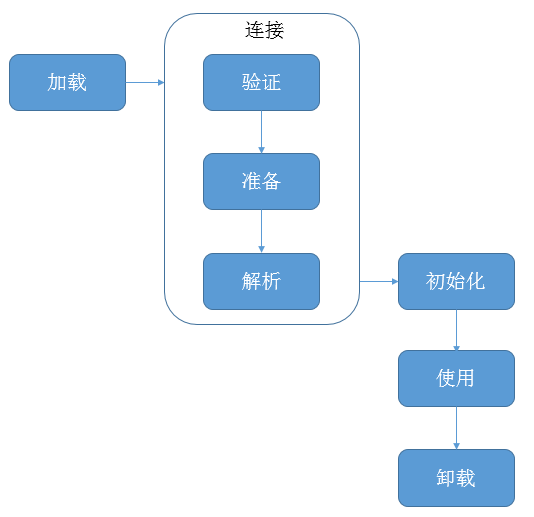
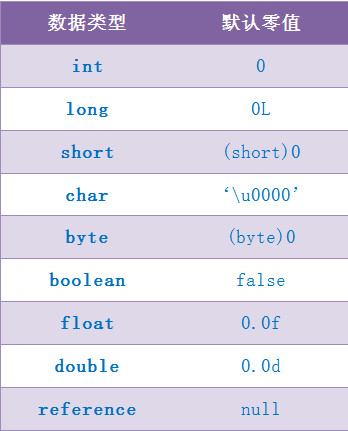
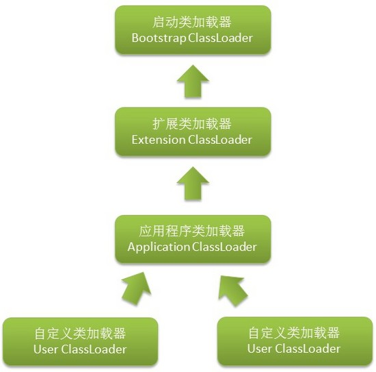

- ## 类加载过程

  - #### 大致过程
java中的类只有被JVM加载之后才能在程序中使用，加载的过程大致为加载-连接-初始化，其中连接又分为验证-准备-解析。
所以细分为**加载-验证-准备-解析-初始化**五个阶段。
其中加载、验证、准备和初始化这四个阶段发生的顺序是确定的，而解析阶段则不一定，有时为了动态绑定也会以在初始化阶段之后开始。
 **类生命周期：**
 

  - #### 类加载的条件
    JVM肯定不会无缘无故就去加载.class，只有主动使用时才会初始化。主动使用有以下几种情况：
     1. 当创建一个类的实例时，比如使用new或者反射，克隆，反序列化。
     2. 当调用类的静态方法时，即使用了字节码invokestatic指令。
     3. 当时用类或接口的静态字段时(final常量除外)，即使用了字节码的getstatic和putstatic指令。
     4. 当使用了java.lang.reflect包中的方法反射类的方法时。
     5. 当初始化子类时，要求先初始化父类。
     6. 作为启动虚拟机，含有main()方法那个类。
     ```java
     public class Parent{
       static{
        System.out.println("parent init");
       }
       public static int v=100;
     }
     public class Child extends Parent{
      static{
        System.out.println("child init");
      }
     }
     public class Main{
      public static void main(String args[]){
        System.out.println(Child.v);
      }
     }
     ```
     运行输出：
     ```
     parent init
     100
     ```
     可以看到只有父类被初始化，子类没有。可见，引用一个子类时(例子中的v)，只有直接定义该字段的类(例子中的父类)，才会被初始化。注意，child虽然没有被初始化但是已经被加载。

 - #### 类加载的过程-加载
      **目的：查找并加载类的二进制数据**
      加载一个类时，JVM需要完成的工作。
      1. 通过类的全名，获取类的二进制数据流。
      2. 解析类的二进制数据流为方法区内的数据结构。
      3. 创建java.lang.Class类的实例，表示该类型。

 - #### 类加载的过程-验证
      **目的：确保Class文件的字节流中包含的信息符合当前虚拟机的要求，并且不会危害虚拟机自身的安全。**
      > 验证阶段是非常重要的，但不是必须的，它对程序运行期没有影响。如果所引用的类经过反复验证，那么可以考虑采用-Xverifynone参数来关闭大部分的类验证措施，以缩短虚拟机类加载的时间。

      验证阶段大致4个阶段：
      1. 文件格式验证
      验证字节流是否符合Class文件格式的规范；例如：是否以0xCAFEBABE开头、主次版本号是否在当前虚拟机的处理范围之内、常量池中的常量是否有不被支持的类型。
      2. 元数据验证
      对字节码描述的信息进行语义分析（注意：对比javac编译阶段的语义分析），以保证其描述的信息符合Java语言规范的要求；例如：这个类是否有父类，除了java.lang.Object之外。
      3. 字节码验证
      通过数据流和控制流分析，确定程序语义是合法的、符合逻辑的。
      4. 符号引用验证
      确保解析动作能正确执行。

 - #### 类加载的过程-准备
      **目的：为类的静态变量分配内存，并将其初始化为默认值**
      > 准备阶段是正式为类变量分配内存并设置类变量初始值的阶段，这些变量所使用的内存都在方法区中进行分配。

      注意：
      - 这时候进行内存分配的仅包括类变量，而不包括实例变量，实例变量会在对象实例化的时候随着对象一起分配在Java堆中；
      - 这里所说的初始值“通常情况”下是数据类型的零值：
        假设一个类变量的定义为： public static int value = 123;
        那变量value在准备阶段过后的初始值为0而不是123，因为此时尚未开始执行任何Java方法，而把value赋值为123的putstatic指令是在程序被编译之后，  存放于类构造器方法中，所以把value赋值为123的动作将在初始化阶段才会执行。但是假设类变量value的定义为：public static final int value = 123;在准备阶段虚拟机就会根据ConstantValue的设置将value赋值为123。
     **JAVA类变量默认值：**
      

 - #### 类加载的过程-解析
   **目的： 把类中的符号引用转换为直接引用**
   > 解析阶段是虚拟机将常量池内的符号引用替换为直接引用的过程，解析动作主要针对类或接口、字段、类方法、接口方法、方法类型、方法句柄和调用点限定符7类符号引用进行。

   **符号引用：**
   > 符号引用以一组符号来描述所引用的目标，符号可以是任何形式的字面量，只要使用时能无歧义地定位到目标即可。符号引用与虚拟机实现的内存布局无关，引用的目标并不一定已经加载到内存当中。各种虚拟机实现的内存布局可以各不相同，但是它们能接受的符号引用必须都是一致的，因为符号引用的字面量形式明确定义在Java虚拟机规范的Class文件格式中。

   **直接引用:**
   > 直接引用可以是直接指向目标的指针、相对偏移量或者是一个能简介定位到目标的句柄。直接引用是和虚拟机实现的内存布局息息相关的，同一个符号引用在不同虚拟机实例上翻译出来的直接引用一般不会相同。如果有了直接引用，那引用的目标必定已经在内存中存在。

 - #### 类加载的过程-初始化
  除了在加载阶段用户应用程序可以通过自定义类加载器参与之外，其余动作均由虚拟机主导和控制。到了初始化阶段，才真正开始执行类中定义的Java程序代码（或者说是字节码）。初始化阶段是执行类构造器clinit方法的过程。
  **在Java中对类变量进行初始值设定有两种方式：**
  ①声明类变量是指定初始值
  ②使用静态代码块为类变量指定初始值。
  **clinit方法**
   1. 由编译器收集类中的所有类变量的赋值动作（如果仅仅只是声明，不会被收集）和静态语句块中的语句合并产生的，收集顺序按照语句在源文件中出现的顺序所决定；在静态语句块中只能访问定义在静态语句之前的变量；而对于定义在静态语句块之后的变量，可以进行赋值，但是不能够访问。

   2. 不需要显示调用父类构造器，虚拟机会保证在子类的clinit()方法执行之前，父类的clinit()方法已经执行完毕，所以，第一个被执行的clinit()方法的类肯定是java.lang.Object。
   3. 父类中定义的静态语句块优先于子类的静态语句。

   4. 此方法对类和接口都不是必须的，若类中没有静态语句块和静态变量赋值操作，则不会生成clinit()方法。

   5. 接口会生成此方法，因为对接口的字段可以进行赋值操作。执行接口的clinit()方法不需要先执行父接口的clinit()方法，只有在使用父接口的变量时，才会进行初始化；接口的实现类在初始化时也不会执行接口的clinit()方法。

   6. 此方法在多线程环境中会被正确的加锁、同步。

---

- ## 类加载器
 - #### 类加载器种类
  
  **1. Bootstrap ClassLoader(启动类加载器)**
  一般由C++实现，是虚拟机的一部分。该类加载器主要职责是将JAVA_HOME路径下的\lib目录中能被虚拟机识别的类库(比如rt.jar)加载到虚拟机内存中。Java程序无法直接引用该类加载器
  **2. Extension ClassLoader(扩展类加载器)**
  由Java实现，独立于虚拟机的外部。该类加载器主要职责将JAVA_HOME路径下的\lib\ext目录中的所有类库，开发者可直接使用扩展类加载器。 该加载器是由sun.misc.Launcher$ExtClassLoader实现。
  **3 Application ClassLoader(应用程序类加载器)**
  该加载器是由sun.misc.Launcher$AppClassLoader实现，该类加载器负责加载用户类路径上所指定的类库。开发者可通过ClassLoader.getSystemClassLoader()方法直接获取，故又称为系统类加载器。当应用程序没有自定义类加载器时，默认采用该类加载器。

 - #### 双亲委托模式
  > 如果一个类加载器收到了类加载请求，他不会尝试自己去加载，而是把这个请求委派给父类加载器去完成，每一个层次的类加载器都是如此，因此所有类加载的请求最终都应该传到顶层的启动类加载器中，只有当父类加载器反馈自己无法完成这个类加载的请求时，子类才会尝试自己加载。但也有弊端， 顶层的ClassLoader无法访问底层的ClassLoader所加载的类所造成的问题。

   - 使用双亲委托模型来组织类加载器之间的关系，有一个显而易见的好处就是Java类随着它的类加载器一起具备了一种带有优先级的层次关系，例如java.lang.Object存放在rt.jar之中，无论那个类加载器要加载这个类，最终都是委托给启动类加载器进行加载，因此Object类在程序的各种类加载器环境中都是同一个类，相反，如果没有双亲委托模型，由各个类加载器去完成的话，如果用户自己写一个名为java.lang.Object的类，并放在classpath中，应用程序中可能会出现多个不同的Object类，java类型体系中最基本安全行为也就无法保证。

 - #### java.lang.ClassLoader
 java.lang.ClassLoader类的基本职责就是根据一个指定的类的名称，找到或者生成其对应的字节代码，然后从这些字节代码中定义出一个Java类,还负责加载 Java 应用所需的资源，如图像文件和配置文件等.
 **ClassLoader 中与加载类相关的方法:**
  | 方法 | 说明 |
  | :-------------- | :------------ |
  | getParent()	|返回该类加载器的父类加载器。|
  | loadClass(String name) | 加载名称为 name 的类，返回的结果是 java.lang.Class 类的实例。|
  | findClass(String name) | 查找名称为 name 的类，返回的结果是 java.lang.Class 类的实例。|
  | findLoadedClass(String name) | 查找名称为 name 的已经被加载过的类，返回的结果是 java.lang.Class 类的实例。|
  | defineClass(String name, byte[] b, int off, int len) | 把字节数组 b 中的内容转换成 Java 类，返回的结果是 java.lang.Class 类的实例。这个方法被声明为 final 的。|
  | resolveClass(Class<?> c) | 链接指定的 Java 类。|

 - #### 自定义类加载器
  定义类加载器可以选择 继承ClassLoader类，重写里面的方法来实现。loadClass()方法重写的话可能会破坏双亲委托模型，不推荐重写；defineClass：主要用于将原始字节转换为Class对象，不需要重写；findClass：根据名称来查找类，一般就重写这个方法。
  ```java
  public class Main {
    static class MyClassLoader extends ClassLoader {
        private String classPath;
        public MyClassLoader(String classPath) {
            this.classPath = classPath;
        }
        private byte[] loadByte(String name) throws Exception {
            name = name.replaceAll("\\.", "/");
            FileInputStream fis = new FileInputStream(classPath + "/" + name
                    + ".class");
            int len = fis.available();
            byte[] data = new byte[len];
            fis.read(data);
            fis.close();
            return data;
        }
        protected Class<?> findClass(String name) throws ClassNotFoundException {
            try {
                byte[] data = loadByte(name);
                return defineClass(name, data, 0, data.length);
            } catch (Exception e) {
                e.printStackTrace();
                throw new ClassNotFoundException();
            }
        }
    };
    public static void main(String args[]) throws Exception {
        MyClassLoader classLoader = new MyClassLoader("D:/test");
        Class clazz = classLoader.loadClass("com.huachao.cl.Test");
        Object obj = clazz.newInstance();
        Method helloMethod = clazz.getDeclaredMethod("hello", null);
        helloMethod.invoke(obj, null);
    }
}
  ```

- ##参考
  - 《实战java虚拟机》
  - http://www.jianshu.com/p/11cc2de9dbc2
  - http://www.cnblogs.com/leesf456/p/5269545.html
  - http://www.jsondream.com/2016/11/16/jvm-class-load-parent-Delegate.html
  - https://www.ibm.com/developerworks/cn/java/j-lo-classloader/#download
  - http://www.jianshu.com/p/acc7595f1b9d?utm_source=tuicool&utm_medium=referral