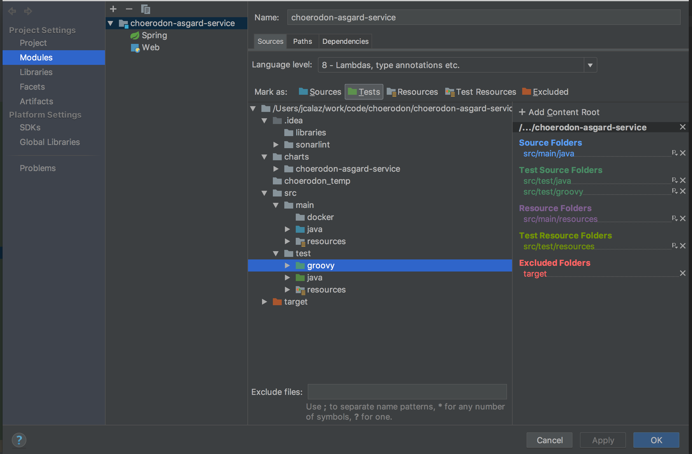

### 示例项目
   - [asgard-service](https://code.choerodon.com.cn/choerodon-framework/choerodon-asgard-service.git)
   
### 技术
   - 框架: [spock](http://blog.codepipes.com/testing/spock-vs-junit.html)
   - 语言: [groovy](http://www.groovy-lang.org)
   - 数据库：[H2](http://www.h2database.com/html/main.html)。 使用H2数据库的mysql模式，直接操作内存数据库。
 
### pom依赖和插件

```xml
 <!-- Test Dependencies -->
 <dependencies>
        <dependency>
            <groupId>org.springframework.boot</groupId>
            <artifactId>spring-boot-starter-test</artifactId>
            <scope>test</scope>
        </dependency>
        <dependency>
            <groupId>io.choerodon</groupId>
            <artifactId>choerodon-liquibase</artifactId>
            <version>${choerodon.starters.version}</version>
            <scope>test</scope>
        </dependency>
        <dependency>
            <groupId>com.h2database</groupId>
            <artifactId>h2</artifactId>
            <version>1.4.197</version>
            <scope>test</scope>
        </dependency>
        <dependency>
            <groupId>org.spockframework</groupId>
            <artifactId>spock-core</artifactId>
            <version>1.1-groovy-2.4-rc-2</version>
            <scope>test</scope>
        </dependency>
        <dependency>
            <groupId>org.spockframework</groupId>
            <artifactId>spock-spring</artifactId>
            <version>1.1-groovy-2.4-rc-3</version>
            <scope>test</scope>
        </dependency>
        <!-- https://mvnrepository.com/artifact/cglib/cglib-nodep -->
        <dependency>
            <groupId>cglib</groupId>
            <artifactId>cglib-nodep</artifactId>
            <version>2.2</version>
            <scope>test</scope>
        </dependency>
   </dependencies>
   
   <build>
           <finalName>app</finalName>
           <plugins>
               <plugin>
                   <groupId>org.codehaus.gmavenplus</groupId>
                   <artifactId>gmavenplus-plugin</artifactId>
                   <version>1.5</version>
                   <executions>
                       <execution>
                           <goals>
                               <goal>addTestSources</goal>
                               <goal>testCompile</goal>
                           </goals>
                       </execution>
                   </executions>
               </plugin>
               <plugin>
                   <groupId>org.apache.maven.plugins</groupId>
                   <artifactId>maven-compiler-plugin</artifactId>
                   <version>3.3</version>
                   <configuration>
                       <source>1.8</source>
                       <target>1.8</target>
                   </configuration>
               </plugin>
               <plugin>
                   <groupId>org.apache.maven.plugins</groupId>
                   <artifactId>maven-surefire-plugin</artifactId>
                   <version>2.18.1</version>
                   <configuration>
                       <includes>
                           <include>**/*Test.java</include>
                           <include>**/*Spec.java</include>
                       </includes>
                   </configuration>
               </plugin>
           </plugins>
       </build>
```

### 目录结构
   
   - IntegrationTestConfiguration.groovy

   ```groovy
   @TestConfiguration
   @Import(LiquibaseConfig)
   class IntegrationTestConfiguration {
   
       private final detachedMockFactory = new DetachedMockFactory()
   
       @Value('${choerodon.oauth.jwt.key:choerodon}')
       String key
   
       @Autowired
       TestRestTemplate testRestTemplate
   
       @Autowired
       LiquibaseExecutor liquibaseExecutor
   
       final ObjectMapper objectMapper = new ObjectMapper()
   
       //Mock KafkaTemplate, 以防spring-for-kafka影响报错
       @Bean
       KafkaTemplate kafkaTemplate() {
           detachedMockFactory.Mock(KafkaTemplate)
       }
   
       @PostConstruct
       void init() {
           //通过liquibase初始化h2数据库
           liquibaseExecutor.execute()
           //给TestRestTemplate的请求头部添加JWT
           setTestRestTemplateJWT()
       }
   
       //restTemplate的请求头部添加token，因为服务有toekn的校验
       private void setTestRestTemplateJWT() {
           testRestTemplate.getRestTemplate().setRequestFactory(new HttpComponentsClientHttpRequestFactory())
           testRestTemplate.getRestTemplate().setInterceptors([new ClientHttpRequestInterceptor() {
               @Override
               ClientHttpResponse intercept(HttpRequest httpRequest, byte[] bytes, ClientHttpRequestExecution clientHttpRequestExecution) throws IOException {
                   httpRequest.getHeaders()
                           .add('JWT_Token', createJWT(key, objectMapper))
                   return clientHttpRequestExecution.execute(httpRequest, bytes)
               }
           }])
       }
   
       static String createJWT(final String key, final ObjectMapper objectMapper) {
           Signer signer = new MacSigner(key)
           CustomUserDetails defaultUserDetails = new CustomUserDetails('default', 'unknown', Collections.emptyList())
           defaultUserDetails.setUserId(0L)
           defaultUserDetails.setOrganizationId(0L)
           defaultUserDetails.setLanguage('zh_CN')
           defaultUserDetails.setTimeZone('CCT')
           String jwtToken = null
           try {
               jwtToken = 'Bearer ' + JwtHelper.encode(objectMapper.writeValueAsString(defaultUserDetails), signer).getEncoded()
           } catch (IOException e) {
               e.printStackTrace()
           }
           return jwtToken
       }
   
   }
   ```
   
   - application-test.yml

```yml
spring:
  cloud:
    bus:
      enabled: false # 关闭bus,否则kafka报错
  sleuth:
    stream:
      enabled: false # 关闭zipkin，否则kafka报错
  datasource:  # 使用内存数据库h2
    password: sa
    url: jdbc:h2:mem:testdb;DB_CLOSE_DELAY=-1;MODE=Mysql;TRACE_LEVEL_SYSTEM_OUT=2;
    username: sa
  autoconfigure: # 关闭LiquibaseAutoConfiguration和KafkaAutoConfiguration的自动化配置
    exclude: org.springframework.boot.autoconfigure.liquibase.LiquibaseAutoConfiguration,org.springframework.boot.autoconfigure.kafka.KafkaAutoConfiguration
hystrix:
  stream:
    queue:
      enabled: false # 关闭hystrix stream，否则kafka报错
data:
  dir: src/main/resources
eureka:
  client:
    enabled: false # 关闭eureka
```

### 编写测试groovy脚本

1. 添加注解@SpringBootTest(webEnvironment = RANDOM_PORT)和@Import(IntegrationTestConfiguration)。
2. 继承Specification且类名为Spec后缀。
3. 注入所需要测试的类对象
4. 通过given(前提条件),when(触发条件),then(期望结果)

```groovy
def "测试 查询某个事务的定义详情"() {
        given: "设置查询id"
        def id = 1L
        def notId = 10L

        and: "mock sagaService"
        def sagaService = Mock(SagaService)
        sagaController.setSagaService(sagaService)

        when: "调用查询事务列表接口"
        def entity = testRestTemplate.getForEntity("/v1/sagas/{id}", SagaWithTaskDTO, id)

        then: "验证状态码成功；验证查询参数生效"
        entity.statusCode.is2xxSuccessful()
        1 * sagaService.query(id)
        0 * sagaService.query(notId)
    }
```

### 如何编写单元测试
- **mock下层依赖**。
   
   编写controller的单测时，mock调用的service层，编写service的单测时，mock调用的mapper层。
   这样代码比较多时，能够快速定位代码异常，也方便提高覆盖率。controller层只校验参数是否合法和和对应的service是否被正确调用。如下一个接口为：
   ```java
    @PutMapping("/{id}/status")
    @ApiOperation(value = "内部接口。更新任务的执行状态")
    @Permission(permissionWithin = true)
    public SagaTaskInstanceDTO updateStatus(@PathVariable Long id, @RequestBody @Valid SagaTaskInstanceStatusDTO statusDTO) {
        statusDTO.setId(id);
        return sagaTaskInstanceService.updateStatus(statusDTO);
    }
   ```
   单元测试应测试sagaTaskInstanceService的updateStatus方法被正确调用，验证statusDTO是否合法：
   ```java
   def "测试 更新任务的执行状态方法"() {
        given: '创建更新状态的SagaTaskInstanceStatusDTO'
        def statusDTO = new SagaTaskInstanceStatusDTO()
        def id = 10L
        def body = new HttpEntity<SagaTaskInstanceStatusDTO>(statusDTO)

        and: 'mock sagaTaskInstanceService'
        def sagaTaskInstanceService = Mock(SagaTaskInstanceService)
        sagaTaskInstanceController.setSagaTaskInstanceService(sagaTaskInstanceService)

        when: '用status为空的DTO调用接口'

        def invalidEntity = testRestTemplate.exchange("/v1/sagas/tasks/instances/{id}/status",
                HttpMethod.PUT, body, ExceptionResponse, id)
        then: '验证状态码；验证错误状态码正确'
        invalidEntity.statusCode.is2xxSuccessful()
        invalidEntity.body.code == "error.updateStatus.statusEmpty"
        0 * sagaTaskInstanceService.updateStatus(_)

        when: '用合法的DTO调用接口'
        statusDTO.setStatus("status")
        def validEntity = testRestTemplate.exchange("/v1/sagas/tasks/instances/{id}/status",
                HttpMethod.PUT, body, String, id)
        then: '验证状态码；验证错误状态码正确'
        validEntity.statusCode.is2xxSuccessful()
        1 * sagaTaskInstanceService.updateStatus(_)
    }
   ```

- **不仅仅正面测试**。还应加入测试异常情况的负面测试，边缘测试。
   
- **减少单元测试耦合性**。 单测之间最好不要相互依赖，单测操作的数据最后不要相互影响，比如有操作数据库的单元测试，加上@Transactional注解，执行完回滚。

- **站在TDD的角度编写单测**。最后先写单测，再写实现代码。即使先写代码，后写测试，也要想下基于TDD如何编写单测。

### 其他

  - 如果在idea不能直接编译运行测试groovy文件，可能是因idea没有识别test/groovy目录。
  
  - spock的expect，where
  ```java
  @Unroll
    def '测试 fulltextSearch方法'() {
        given: '准备查询数据'
        def dbData = new SagaInstance('fs_code', 'fs_type', 'fs_id', 'fs_status', new Date(), new Date())
        sagaInstanceMapper.insert(dbData)

        expect: '期望的结果数量'
        sagaInstanceMapper.fulltextSearch(sagaCode, status, refType, refId, params).size() == size

        where: '验证查询结果数量'
        sagaCode   || status      || refType   || refId   || params      || size
        'fs_code'  || null        || null      || null    || null        || 1
        null       || 'fs_status' || null      || null    || null        || 1
        null       || null        || 'fs_type' || null    || null        || 1
        null       || null        || null      || 'fs_id' || null        || 1
        'fs_code1' || null        || null      || null    || null        || 0
        null       || null        || null      || null    || 'fs_code'   || 1
        null       || null        || null      || null    || 'fs_type'   || 1
        null       || null        || null      || null    || 'fs_id'     || 1
        null       || null        || null      || null    || 'fs_status' || 1
        null       || null        || null      || null    || 'fs_test'   || 0
    }
  ```

