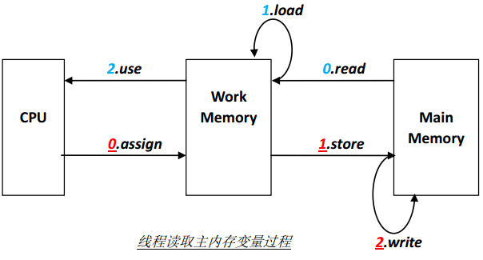

## volatile

- ###作用: 
  使变量在多个线程中可见;强制从公共堆栈中取得变量的值，而不是从线程私有数据栈中取得变量的值。

- ###与synchronized对比:
  1. volatile可以保证数据的可见性，但不可以保证原子性
  2. synchronized可以保证原子性，也可以间接保证可见性
  3. synchronized有volatile同步的功能

- ###示例:
```java
public class RunThread extends Thread{
    private boolean isRunning=true;
    public boolean isRunning(){
        return isRunning;
    }
    public void setRunning(boolean isRunning){
        this.isRunning=isRunning;
    }
    @Override
    public void run(){
        System.out.println("进入run了");
        while (isRunning==true){
        }
        System.out.println("线程被停止了");
    }
}

public class Main{
    public static void main(String args[]){
        try{
            RunThread thread=new RunThread();
            thread.start();
            Thread.sleep(1000);
            thread.setRunning(false);
            System.out.println("已经赋值为false");
        }catch (InterruptedException e){
            e.printStackTrace();
        }
    }
}
```
运行时加入JVM参数, -server。查看结果发现System.out.println("线程被停止了");从未执行。

因为JVM被设置为-server模式时为了线程的运行效率，线程一直在私有堆栈中取得isRunning的值为true，而更新的却是公共堆栈中的isRunning。

解决方法：volatile private boolean isRunning=true;

- ###线程工作内存和主工作内存之间通过8中原子操作实现

    1. lock（锁定）：作用于主内存的变量，它把一个变量标识为一条线程独占的状态。
    
    2. unlock（解锁）：作用于主内存的变量，它把一个处于锁定状态的变量释放出来，释放后的变量才可以被其它线程锁定。
    
    3. read（读取）：作用于主内存的变量，它把一个变量的值从主内存传输到线程的工作内存中，以便随后的load动作使用。
    
    4. load（载入）：作用于工作内存的变量，它把read操作从主内存中得到的变量值放入工作内存的变量副本中。
    
    5. use（使用）：作用于工作内存的变量，它把工作内存中一个变量的值传递给执行引擎，每当虚拟机遇到一个需要使用到变量的值的字节码指令时将会执行这个操作。
    
    6. assign（赋值）：作用于工作内存的变量，它把一个从执行引擎接收到的值赋给工作内存的变量，每当虚拟机遇到一个给变量赋值的字节码指令时执行这个操作。
    
    7. store（存储）：作用于工作内存的变量，它把工作内存中一个变量的值传送给主内存中，以便随后的write操作使用。
    
    8. write（写入）：作用于主内存的变量，它把store操作从工作内存中得到的变量的值放入主内存的变量中。

    

    ***对于volatile修饰的变量，只能保证从主内存到工作内存的值是最新的，但像use和assign这些操作并不是原子性的，因此volatile无法保证原子性***

- ###使用原子类进行i++操作
```java
import java.util.concurrent.atomic.AtomicInteger; 
public class AddCountThread extends Thread{
    private AtomicInteger count=new AtomicInteger(0);
    @Override
    public void run(){
        for (int i=0;i<1000;i++){
            System.out.println(count.incrementAndGet());
        }
    }
}

public class Main{
    public static void main(String args[]){
        AddCountThread thread=new AddCountThread();
        new Thread(thread).start();
        new Thread(thread).start();
        new Thread(thread).start();
        new Thread(thread).start();
        new Thread(thread).start();
    }
}
```

- ###原子类也不完全安全
```java
import java.util.concurrent.atomic.AtomicLong;
public class MyService{
    public static AtomicLong aiRef=new AtomicLong();
    public void addNum(){
        System.out.println(Thread.currentThread().getName()+"加了100后的值是:"+aiRef.addAndGet(100));
        aiRef.addAndGet(1);
    }
}

public class MyThread extends Thread{
    private MyService myService;
    public MyThread(MyService myService){
        super();
        this.myService=myService;
    }
    @Override
    public void run(){
        myService.addNum();
    }
}

public class Main{
    public static void main(String args[]){
        try{
        MyService service=new MyService();
        MyThread[] myThreads=new MyThread[5];
        for (int i=0;i<myThreads.length;i++){
            myThreads[i]=new MyThread(service);
        }
        for (int i=0;i<myThreads.length;i++){
            myThreads[i].start();
        }
        Thread.sleep(1000);
        System.out.println(service.aiRef.get());    
        }catch (InterruptedException e){
            e.printStackTrace();
        }
        
    }
}
```

运行发现打印出错，这是因为addAndGet()方法虽然是原子性的，但方法与方法之间的调用不是原子性的。

#####参考:
- JAVA多线程编程核心技术
- 深入理解Java虚拟机