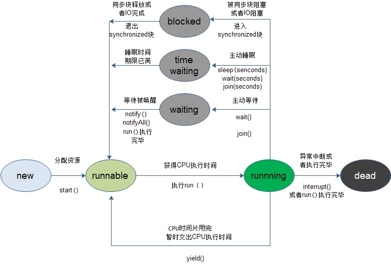

1. 不使用等待/通知机制实现线程间通信。
   > 可使用轮询机制实现，比如用while语句一直查询，但会浪费CPU的资源

2. ### 等待/通知机制的实现

   Object类的wait()方法可以使调用该方法的线程释放共享资源的锁，然后从运行状态退出，进入等待队列，直到被再次唤醒。
   
   Object类的wait(long timeout)方法：等待某一个时间内是否有线程对锁进行唤醒，如果超过这个时间将自动唤醒。

   Object类的wait(long timeout,int nanos)方法：等待某一个时间内是否有线程对锁进行唤醒，如果超过这个时间将自动唤醒。相比wait(long timeout)，控制时间更精确，时间为1000000*timeout+nanos 纳秒
   
   Object类的notify()方法可以随机唤醒等待队列中等待同一共享资源的**一个**线程，并使该线程退出等待队列，进入可运行的状态，也就是notify()方法仅通知"一个"线程。

   Object类的notifyAll()方法可以使所有正在等待队列中等待同一资源的**全部**线程从等待状态退出，进入可运行的状态。此时，优先级最高的线程执行，但也有可能随机执行，这要取决于JVM的实现。

3. demo
(1). wait的使用效果，wait以后代码不在执行，进入等待。
```java
public class Main{
 public static void main(String[] args){
  try{
  String lock=new String();
  System.out.print("one ");
  synchronized (lock){
      System.out.print("two ");
      lock.wait();
      System.out.print("three ");
  }
  System.out.print("four");
  }catch (InterruptedException e){
      e.printStackTrace();
  }
 }    
}
```
输出: one two

(2). 一个简单的wait/notify
```java
public class WaitThread  extends Thread{
    private Object lock;
    public WaitThread(Object lock){
        super();
        this.lock=lock;
    }
    @Override
    public void run(){
        try{
          synchronized (lock){
              System.out.print("before wait,");
              lock.wait();
              System.out.print("after wait,");
          }
          System.out.print("after synchronized");
          }catch (InterruptedException e){
              e.printStackTrace();
          }
    }
} 

public class NotifyThread  extends Thread{
    private Object lock;
    public NotifyThread(Object lock){
        super();
        this.lock=lock;
    }
    @Override
    public void run(){
        try{
          synchronized (lock){
              System.out.print("before notify,");
              lock.notify();
              System.out.print("after notify,");
          }
          }catch (InterruptedException e){
              e.printStackTrace();
          }
    }
}

public class Main{
    public static void main(String args[]){
        try{
        Object lock=new Object();
        WaitThread waitThread=new WaitThread(lock);
        waitThread.start();
        Thread.sleep(1000);
        NotifyThread notifyThread = new NotifyThread(lock);
        notifyThread.start();
        }catch (InterruptedException e){
          e.printStackTrace();
        }
    }
}
```
打印结果: before wait,before notify, after notify, after wait,after synchronized


4. ### wait/notify注意事项和问题。

   - 执行完wait后会释放锁， 在执行notify()方法后，当前线程不会立刻释放该对象锁。呈wait状态的线程并不能马上获取该对象锁，要等执行notify()方法的线程将程序执行完，也就是退出synchronized代码块后，当前线程才会释放锁。
      
   - 在调用wait()或notify()方法之前，必须获得该对象的对象级别锁，即只能在同步方法或者同步块中调用wait()方法，在执行wait()方法之后，当前线程释放锁。
   
   - 在调用notify通知某线程后，该线程不会立即进入Running状态，而是先进入Runnable状态。
      
   - notify每次仅通知一个线程，多次调用可将wait线程全部唤醒。
   
   - 当线程呈wait状态时，调用线程对象的**interrupt**方法会抛出InterruptedException异常。
   
   - **通知过早**: 如果通知过早，会打乱程序正常运行逻辑。
      
      比如demo(2)中将Main类改为NotifyThread线程先执行。
      ```java
      public class Main{
          public static void main(String args[]){
              try{
              Object lock=new Object();
              NotifyThread notifyThread = new NotifyThread(lock);
              notifyThread.start();
              Thread.sleep(1000);
              WaitThread waitThread=new WaitThread(lock);
              waitThread.start();
              }catch (InterruptedException e){
                e.printStackTrace();
              }
          }
      }
      ```
      此时wait线程不会被通知。
      
   - 等待wait的条件发生变化。
   ```java
    public class ValueObj{
     public static java.util.List list=new java.util.ArrayList();
    }
 
    public class Add{
     private String lock;
     public Add(String lock){
      this.lock=lock;
     }
     public void add(){
      synchronized (lock){
       ValueObj.list.add("anything");
       lock.notifyAll();
      }
     }
    }
    public class Subtract{
      private String lock;
      public Subtract(String lock){
       this.lock=lock;
      }
      public void subtract(){
       synchronized (lock){
        if (ValueObj.list.size()==0){
         System.out.println("before wait");
         lock.wait();
         System.out.println("after wait");
        }
        ValueObj.list.remove(0);
        System.out.println("list size: "+ValueObj.list.size());
       }
      }
    }
    public class Main{
     public static void main(String args[]){
      String lock=new String("");
      Add add=new Add(lock);
      Subtract subtract=new Subtract(lock);
      new Thread((Subtract r)-> r.subtract()).start();
      new Thread((Subtract r)-> r.subtract()).start();
      Thread.sleep(1000);
      new Thread((Add p)-> p.add()).start();
     } 
    }
   ```
   运行将发生异常。原因是两个减操作都执行了wait方法呈wait状态，当执行加操作list的size为1，且通知两个减操作继续执行，因为list的size为1，第二个减操作将发生索引溢出异常。
   
   要想正确应修正subtract的方法，如下：
   ```java
    public class Subtract{
         private String lock;
         public Subtract(String lock){
          this.lock=lock;
         }
         public void subtract(){
          synchronized (lock){
           if (ValueObj.list.size()==0){
            System.out.println("before wait");
            lock.wait();
            System.out.println("after wait");
            ValueObj.list.remove(0);
            System.out.println("list size: "+ValueObj.list.size());
           }
          }
         }
       }
   ```

5. ### 线程状态切换
    

    1. 新建一个线程后，调用它的start()方法,系统会为此线程分配CPU资源，使其处于Runnable(可运行)状态，这是一个准备的阶段。如果线程抢占到CPU资源，此线程就处于Running(运行)状态。

    2. Runnable状态和Running状态因为CPU资源的抢占可互换。线程从Running状态进入Runnable状态情况大致分为5种:

       - 调用sleep()方法后经过的时间超过了指定的睡眠时间。

       - 线程调用堵塞IO已经返回，阻塞方法将执行完毕。

       - 线程成功地获得了试图同步的监视器。

       - 线程正在等待某个通知，其他发出了通知。

       - 处于挂起状态的线程调用了resume恢复方法。

    3. Blocked状态是阻塞状态。例如遇到了一个IO的操作，此时CPU会处于空闲状态，可能会把CPU时间片分配给其他线程，这时也可以称之为"暂停"状态.Blocked状态结束后，进入Runnable状态，等待线程重新分配资源。出现Blocked情况大致分为5种：

       - 线程调用sleep状态，主动放弃占用的处理器资源。

       - 线程调用了阻塞式IO方法，在该方法返回前，该线程被堵塞。

       - 线程试图获取一个同步监视器，但该监视器正在被其他线程持有。

       - 线程等待某个通知。

       - 程序调用了suspend方法该线程挂起。(此方法易导致死锁)

    4. run()方法结束后进入销毁状态，整个线程执行完毕。

    > 每个锁对象都有两个队列，一个就绪队列，一个阻塞队列。就绪队列存储了将要获得锁的线程，阻塞队列存储了被堵塞的线程。一个线程被唤醒后，才会进入就绪队列，等待CPU的调度；反之，一个线程被wait之后，就会进入堵塞队列，等待下一次被唤醒。

#####参考:
- 《JAVA多线程编程核心技术》
- http://www.cnblogs.com/dolphin0520/p/3920357.html
- http://www.cnblogs.com/LipeiNet/p/6475851.html?utm_source=tuicool&utm_medium=referral