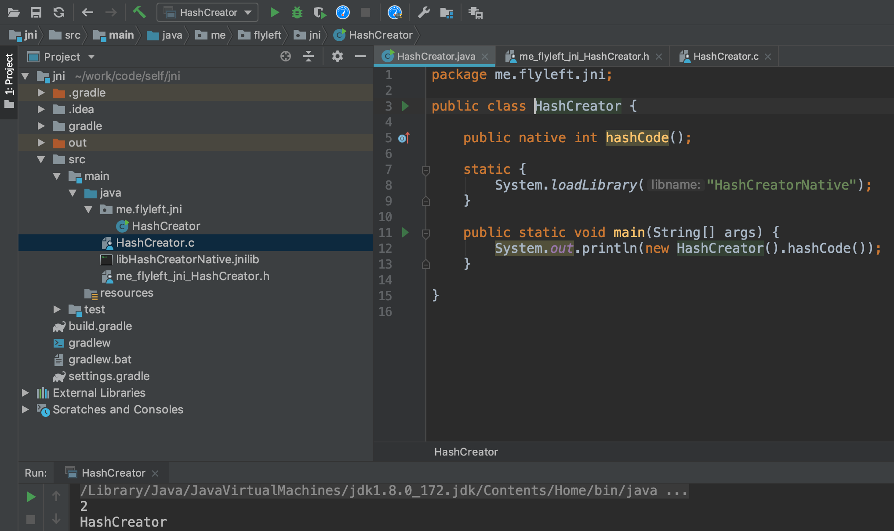

[JNI](https://en.wikipedia.org/wiki/Java_Native_Interface)即Java Native Interface，是JDK提供的一种与c/c++交互的手段。
JNI使用非常普遍，比如Object类的hashCode方法、Thread类的start0方法、原子类中使用的Unsafe、netty中实现NIO时都使用到了JNI。

## JNI的使用

1. 编写带有native的java类

	```java
	public class HashCreator {
	
	    //声明一个native方法
	    public native int hashCode();
	
	    //加载native库(Windows上为HashCreatorNative.dll, linux上为libHashCreatorNative.so, mac上为Windows上为libHashCreatorNative.jnilib)
	    static {
	        System.loadLibrary("HashCreatorNative"); 
	    }
	    
	    public static void main(String[] args) {
	        System.out.println(new HashCreator().hashCode());
	    }
	    
	}
	```

2. 调用javah生成头文件

	```
	javah -classpath . -encoding UTF-8 -jni me.flyleft.jni.HashCreator
	```
	
	生成`me_flyleft_jni_HashCreator.h`内容为:
	
	```c
	/* DO NOT EDIT THIS FILE - it is machine generated */
	#include <jni.h>
	/* Header for class me_flyleft_jni_HashCreator */
	
	#ifndef _Included_me_flyleft_jni_HashCreator
	#define _Included_me_flyleft_jni_HashCreator
	#ifdef __cplusplus
	extern "C" {
	#endif
	/*
	 * Class:     me_flyleft_jni_HashCreator
	 * Method:    hashCode
	 * Signature: ()I
	 */
	JNIEXPORT jint JNICALL Java_me_flyleft_jni_HashCreator_hashCode
	  (JNIEnv *, jobject);
	
	#ifdef __cplusplus
	}
	#endif
	#endif
	```
3. 编写c语言实现native方法(文件名随意，这里设置成HashCreator.c)

	```c
	#include <stdio.h>
	
	#include "me_flyleft_jni_HashCreator.h"
	
	JNIEXPORT jint JNICALL Java_me_flyleft_jni_HashCreator_hashCode(JNIEnv *env, jobject oc) {
	
	 printf("HashCreator\n");//打印一行日志
	
	 return (jint)2;//这里直接返回2
	}
	```

4. 编译动态链接库
   - Mac上:
   ```
   gcc -dynamiclib HashCreator.c -o libHashCreatorNative.jnilib -I/Library/Java/JavaVirtualMachines/jdk1.8.0_172.jdk/Contents/Home/include/  -I/Library/Java/JavaVirtualMachines/jdk1.8.0_172.jdk/Contents/Home/include/darwin/
   ```
   - Windows上:
   ```
   gcc -shared HashCreator.c -o HashCreatorNative.dll -I/... -I/...
   ```
   
   - Linux上:
   ```
   gcc -shared HashCreator.c -o libHashCreatorNative.so -I/... -I/...
   ```
   
   `-I`参数是为了指出引用的`jni.h`和`jni_md.h`文件所在目录
   
5. 运行HashCreator中main函数测试，运行时通过JVM参数指定`java.library.path`为链接库所在目录

   ```
   JVM参数: -Djava.library.path=/Users/jcalaz/work/code/self/jni/src/main/java
   ```
   运行结果：
   
   
   
   