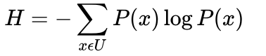

- 数据校验(page 12)
  > 犹太人发明了一种类似于我们今天计算机和通信中的校验码的方法。他们把每一个希伯来字母对于一个数字，这样每行文字加起来便得到一个特殊的数字，这个数字便成为了这一行的校验码。同样，对于每一列也是这样处理。当犹太学者抄完一页《圣经》时，他们需要把每一行的文字加起来，看看新的校验码是否和原文的相同。

- 图灵测试(page 16)
  > 让人与机器进行交流，如果人无法判断自己交流的对象是人还是机器，就说明这个机器有智能了。
  
- 翻译统计语言模型
  1. 条件概率(page 28)
  
     > 假定S表示某一个有意义的句子，由一连串特定顺序排列的词W1,W2,W3,...,Wn组成，这里n是句子的长度。
     ```
     P(S)=P(W1,W2,...,Wn)=P(W1)*P(W2|W1)*(W3|W1,W2)...P(Wn|W1,W2,...,Wn-1)
     ```
  2. 统计语言的二元模型-马尔科夫假设(page 29)
     > 假设任意一个词Wi出现的概率只同它前面的词Wi-1有关。
     ```
     P(S)=P(W1)*P(W2|W1)*(W3|W2)...P(Wi|Wi-1)...P(Wn|Wn-1)
     ```
  3. 估计条件概率P(Wi|Wi-1)(page 30)
     ```
     P(Wi|Wi-1)=P(Wi-1,Wi)/P(Wi-1)
     有了大量的语料库，只要数一数Wi-1,Wi这对词在统计的文本中前后相邻出现了多少次#(Wi-1,Wi),
     以及Wi-1本身在同样的文本中出现了多少次#(Wi-1):
     P(Wi|Wi-1)=#(Wi-1,Wi)/#(Wi-1)
     ```
   4. 古德-图灵估计(page 35)
     > 对于没有看见的事件，我们不能认为它发生的概率就是零，因此我们从概率的总量中，分配一个很小的比例给这些没有看见的事件。这样一来，看见的那些事件的概率总和就要小于1，因此，需要将所有看见的事件的概率调小一点，至于要小多少，要根据"越是不可信的统计折扣越多"的方法进行。

- 分词
   1. 查字典分词(page 42)
    
   		> 把一个句子从左到右扫描一遍，遇到字典里有的词就标识出来，遇到复合词(比如"上海大学")就找到最长的词匹配，遇到不认识的字串就分割成单字词，于是简单的分词就完成了。
   2. 统计语言模型分词(page 43)
    	> 最好的分词方法应保证分完词后这个句子出现的概率最大。
   3. 词的颗粒度与层次(page 47)
    	> 词的颗粒度指词的个数，进行语义分析的文本，要求分词结果的颗粒度越大表示的含义越确切。分词的层次：首先根据基本词表和复合词表各建立一个语言模型L1和L2。L1对句子进行分词，得到小颗粒度的分词结果。此时字串是输入，词串是输出。在此基础上，
   L2进行第二次分词，此时输入是基本词串，输出是复合词串。这样，L1可以得到颗粒度小的词，L2可以得到颗粒度大的复合词。用户可以自由选择使用。
 
- 隐含马尔可夫模型
  1. 通信系统(Page 50)
   
   	雅格布森通信六要素：说话者、受话者、语境、信息、接触、代码
  2. 马尔可夫假设(Page 53)
 
    	> 随机过程中各个状态的St的概率分布，只与它前一个状态St-1有关，符合这个假设的的随机过程称为马尔可夫过程
  3. 隐含马尔可夫模型(Page 53)
      > 任一时刻t的状态St不可见，但每个时刻会输出一个与St有关切仅与St有关的Ot，其中隐含的状态S1,S2,S3...是一个典型的马尔可夫链。可以计算出某特定序列S1,S2,S3,...产生输出符号O1,O2,O3...的概率: P(S1,S2,S3,...O1,O2,O3,...) = ∏P(St|St-1)*P(Ot|St)
  4. 隐含马尔可夫模型的三个基本问题(Page 56)
     - 给定一个模型，如何计算某个特定的输出序列的概率。 —— **forward-backward算法**
     - 给定一个模型和某个特定的输出序列，如何找到最可能产生这个输出的状态序列。 —— **维特比算法**
     - 给定足够量的观测数据，如何估计隐含马尔可夫模型的参数。—— **模型的训练**
  5. 模型的训练(Page 57)
    
     > 从前一个状态St-1进入当前状态St的概率P(St|St-1)称为转移概率，每个状态St产生相应符号Ot的概率P(Ot|St)，称为生成概率。这些概率称为隐含马尔可夫模型的参数，而计算或者估计这些参数的过程称为模型的训练。
  6. 有监督的训练方法(Page 57)
     > P(Ot | St)=P(Ot, St) / P(St) ≈ #(Ot, St) / #(St), P(St | St-1) = P(St-1, St) / P(St-1) ≈ #(Si-1, Si) / #(Si-1), 数据为人工标注。
  7. 无监督的训练方法(Page 58)
     > 仅仅通过大量的观测到的信号O1,O2,O3,...就能推算模型参数的P(St | St-1)和P(Ot | St)的方法。其中主要使用鲍姆-韦尔奇算法。
  8. 鲍姆-韦尔奇算法(Page 58)
     > 两个不同的隐含马尔可夫模型可以产生相同的输出信号，但总会有一个模型Mo2比另一个Mo1更有可能产生观测到的输出，鲍姆-韦尔奇算法就是寻到最有可能的模型Mo。算法思路: 1.反复的估计所得的计数，从转移概率和观察概率的一个估计值开始，反复的使用这些估计概率来推出越来越好的概率。2.对于一个观察，计算它向前概率，从而得到我们估计的概率。然后把这个估计的概率量，在对于这个向前概率有贡献的所有不同路径上进行分摊。输出概率的最大化过程称为EM过程，EM可以保证收敛到局部最优点，无法保证能找到全局最优点，除非是凸函数。   
     
- 信息的度量与作用
  1. 信息熵
 
      
     > 就是平均而言发生一个事件我们得到的信息量大小。所以数学上，信息熵其实是信息量的期望。
  2. 信息消除不确定性
     > 假设一个事物内部会存在不确定性，假定为U，而从外部消除这个不确定唯一的办法就是引入信息I，而引入的I需>U, 如果I < U，这些信息可以消除一部分不确定性，反之，如果没有任何信息，任何公示或者数字都无法排除不确定性。
## 参考
  - 《数学之美》
  -  https://www.cnblogs.com/baiboy/p/hmm5.html