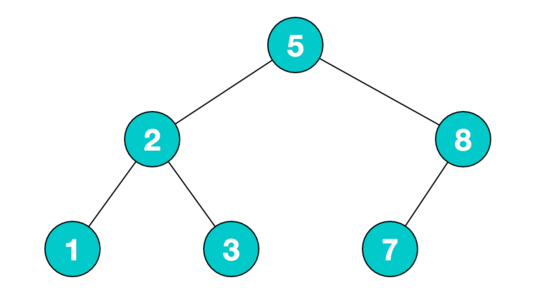
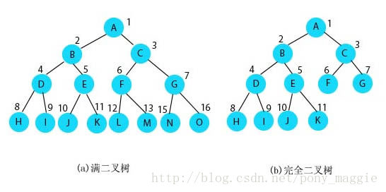
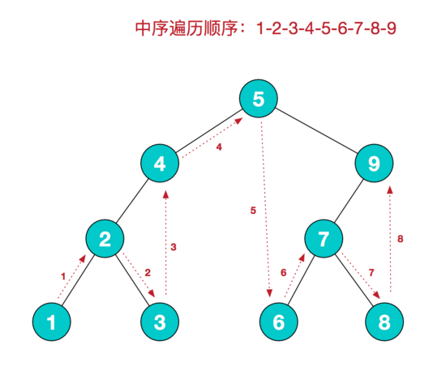
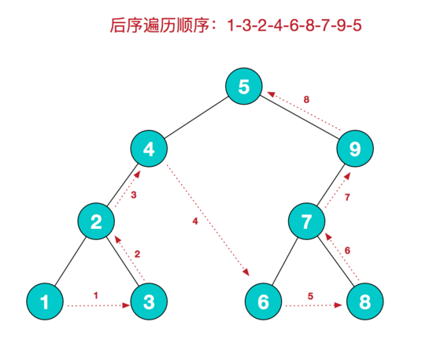

- ## 树
    - #### 树的定义
      树是n(n>=0)个结点的有限集(n= 0时称为空树)。
    
      在任意一颗非空树种:
    
      1. 有且仅有一个特定的称为根(Root)的结点;
      2. 当n>1时,其余结点可分为m(m>0)个互不相交的有限集T1,T2,.......Tm,其中每一个集合本身又是一颗树,并且称为根的子数。
    
    - #### 树其他定义
      
      1. 度为0的结点称为叶结点或终端结点。度不为0的结点称为非终结点或分支结点。除根结点之外,分支结点也称为内部结点,树的度是树内各结点的度的最大值
      2. 树的高度是 所有节点深度中的最大值。
      3. 结点的子数的根称为该结点的孩子,相应的,该结点称为孩子的双亲.同一个双亲的孩子之间互称兄弟,
      结点的祖先是从根到该结点所经分支上的所有结点,以某结点为根的子树中的任一结点都称为该结点的子孙。
      4. 其双亲在同一层的互为堂兄弟
      
    - #### 树结构和线性结构的对比
      - **线性结构**:
        1. 第一个数据结构:无前驱
        2. 最后一个数据元素:无后继
        3. 中间元素:一个前驱一个后继
        
      - **树结构**:
        1. 根结点:无双亲,唯一
        2. 叶结点:无孩子,可以多个
        3. 中间结点:一个双亲多个孩子
  
---

- ## 二叉树
  - #### 二叉树的定义
    二叉树就是每个结点最多有两个子树的树形存储结构。
    
  - #### 二叉树的性质

     1. 若左子树不空，则左子树上所有结点的值均小于或等于它的根结点的值；
     2. 若右子树不空，则右子树上所有结点的值均大于或等于它的根结点的值；
     3. 左、右子树也分别为二叉排序树；
    
      
     
  - #### 二叉树与树的区别
    
     1. 树不可以为空集合，但是二叉树可以。
     2. 树的分支度为d>=0，但是二叉树的节点分支度为0<=d<=2;
     3. 树的子树之间没有次序关系，二叉树则有。
     
  - #### 满二叉树和完全二叉树
  
    
    
    1. 满二叉树一定是完全二叉树，反过来不一定。
    2. 满二叉树的定义是除了叶子结点，其它结点左右孩子都有,深度为k的满二叉树，结点数就是2的k次方减1。
    3. 完全二叉树是每个结点都与深度为k的满二叉树中编号从1到n一一对应。
  
  - #### 二叉树的遍历

    二叉树的遍历是指从根节点出发，按照某种次序依次访问二叉树中所有结点，使得每个结点被访问一次且仅被访问一次。
    二叉树的遍历方式主要有： **前序遍历，中序遍历，后序遍历**。
  
    1. **前序遍历(根树-左子树-右子树)**

      前序遍历的规则是：若二叉树为空，则空操作返回，否则先访问根节点，然后前序遍历左子树，再前序遍历右子树。
      
      
      
    2. **中序遍历(左子树-根树-右子树)**

      中序遍历的规则是:若树为空，则空操作返回；否则遍历根节点的左子树，然后是访问根节点，最后中序遍历右子树。
      
      
      
    3. **后序遍历(左子树-右子树-根树)**

      后序遍历的规则是:若树为空，则空操作返回；然后先遍历左子树，再遍历右子树，最后访问根结点。
      
      
  
    总结一下就是：左子树总在右子树之前访问(同一层中)，前序中序指的是**根节点**访问次序。
  
  - #### 二叉树的表示方式
    1. **数组表示法**
      要想使用一维数组表示二叉树，首先将二叉树想象成满二叉树，且第k个阶度具有2^k-1个节点，并且依次存放在一维数组中。
      
    2. **列表表示法**
       ```java
       public class TreeNode {
           private int value;
           private TreeNode leftNode;
           private TreeNode rightNode;
           public TreeNode(int value) {
               this.value = value;
           }
           public void setValue(int value) {
               this.value = value;
           }
       }
        public class BinaryTree {
            private TreeNode root;
            public BinaryTree(int[] data) {
               for (int i:data){
                   addValue(i);
               }
            }
            private void addValue(int value){
              TreeNode currentNode=root;
              if (root==null){
                  root=new TreeNode(value);
                  return;
              }
              while (true){//循环判断要插入的位置
                  if (value<currentNode.getValue()){//小于当前value的值，则为左子树
                      if(currentNode.getLeftNode()==null){
                          currentNode.setLeftNode(new TreeNode(value));
                          return;
                      }else currentNode=currentNode.getLeftNode();
                  }else {////大于当前value的值，则为右子树
                      if (currentNode.getRightNode() == null) {
                          currentNode.setRightNode(new TreeNode(value));
                          return;
                      } else currentNode=currentNode.getRightNode();
                  }
              }
            }
        }
       ```
  
  
  
  
  
  
- ## 参考
  - 《图解数据结构-java版》
  - http://www.jianshu.com/p/3c980f3e7da3
  - http://www.cnblogs.com/chengxiao/p/6358375.html
  - http://blog.csdn.NET/pony_maggie/article/details/38390513