- ## 图的定义

  图是由顶点的有穷非空集合和顶点之间边的集合组成。
  通常表示为：G（V，E）。其中，G表示一个图，V是图G中顶点的集合，E是图G中边的集合。

- ## 图相关概念
  
  1. 无向图(图中任意两个顶点的边都是无向边)
    
    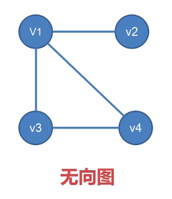

  2. 有向图(图中任意两个顶点的边都是有向边)
  
    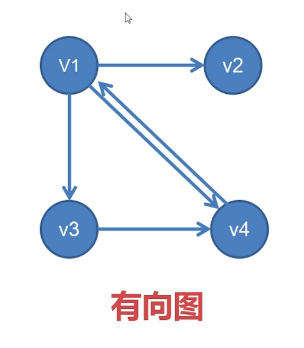
    
  3. 度： 在无向图中，一个顶点所拥有的总数为度。
  
  4. 入/出度： 在有向图中，以该顶点为终点的变数称为入度，为起点则为出度。
  
  5. 路径长度：路径上包含边的数量称为路径长度。
  
  6. 完全图：边数 = 顶点数 *（ 顶点数 - 1 ） / 2
  
  7. 生成树 ： 边数 = 顶点数 - 1
  
  8. 连通图：当任意一个结点都能直接或间接到其他全部结点的时候，就称为连通图

- ## 图的存储方式
  
   1. **邻接矩阵法**
      > 使用数组的形式来储存数据
      
      - 在无向图中，边是相当于两个顶点相互指向
        
        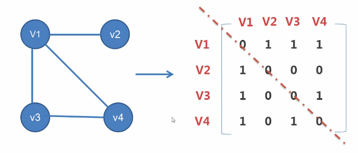
        
        ```java
        public    class CH07_01
        {
        public static void main(String args[]) throws IOException
           {  
        	int [][] data={{1,2},{2,1},{1,5},{5,1}, //图形各边的起点值及终点值
        					{2,3},{3,2},{2,4},{4,2},
        					{3,4},{4,3},{3,5},{5,3},
        					{4,5},{5,4}};
        	//声明矩阵arr
        	int arr[][] =new int[6][6];
        	int i,j,k,tmpi,tmpj;            
        	
        	for (i=0;i<6;i++)          //把矩阵清零
        		for (j=0;j<6;j++)
        			arr[i][j]=0;
        	for (i=0;i<14;i++)         //读取图形数据
        		for (j=0;j<6;j++)      //填入arr矩阵
        			for (k=0;k<6;k++)
        			{  
        				tmpi=data[i][0];    //tmpi为起始顶点
        				tmpj=data[i][1];    //tmpj为终止顶点
        				arr[tmpi][tmpj]=1;  //有边的点填入1
        			}
        	System.out.print("无向图形矩阵：\n");
        	for (i=1;i<6;i++)
        	{  
        		for (j=1;j<6;j++)
        	    System.out.print("["+arr[i][j]+"] ");   //打印矩阵内容
        		System.out.print("\n");
        	}
           }
        }

        ```
        
      - 在有向图中，当一个顶点能够指向另外一个顶点，则矩阵中的值为1，否则为0
      
        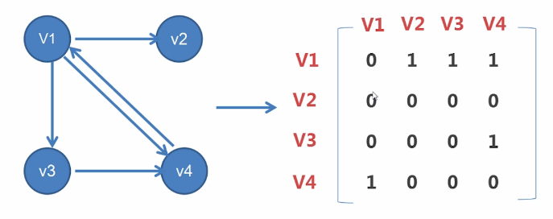
        
        ```java
        public    class CH07_02
        {
        public static void main(String args[]) throws IOException
           {  
        		int arr[][]=new int[5][5];  //声明矩阵arr
        		int i,j,tmpi,tmpj;     
        		int [][] data={{1,2},{2,1},{2,3},{2,4},{4,3}};  //图形各边的起点值及终点值
        		for (i=0;i<5;i++)           //把矩阵清零
        			for (j=0;j<5;j++)
        				arr[i][j]=0;
        		for (i=0;i<5;i++)       //读取图形数据
        			for (j=0;j<5;j++)   //填入arr矩阵
        			{  
        				tmpi=data[i][0];     //tmpi为起始顶点
        				tmpj=data[i][1];     //tmpj为终止顶点
        				arr[tmpi][tmpj]=1;   //有边的点填入1
        			}
        		System.out.print("有向图形矩阵：\n");
        	for (i=1;i<5;i++)
        	{  
        		for (j=1;j<5;j++)
        	    System.out.print("["+arr[i][j]+"] ");   //打印矩阵内容
        		System.out.print("\n");
        	}
           }
        }
        ```
        
   2. **相邻表法**
     > 使用顶点以及其弧的指向来储存数据。一个顶点使用一个表。
     
     
     
     ```java
     class Node 
     {
     	int x;
     	Node next;
     	public Node(int x)
     	{
     		this.x=x;
     		this.next=null;
     	}
     }
     class GraphLink
     {
     	public Node first;
     	public Node last;
     	public boolean isEmpty()
     	{
     		return first==null;
     	}
     	public void print()
     	{
     		Node current=first;
     		while(current!=null)
     		{
     			System.out.print("["+current.x+"]");
     			current=current.next;
     		}
     		System.out.println();
     	}
     	public void insert(int x)
     	{
     		Node newNode=new Node(x);
     		if(this.isEmpty())
     		{
     			first=newNode;
     			last=newNode;
     		}
     		else
     		{
     			last.next=newNode;
     			last=newNode;
     		}
     	}
     }
     public class CH07_03
     {	
     	public static void main (String args[])throws IOException
     	{
     		int Data[][] =		//图形数组声明
     
     			{ {1,2},{2,1},{1,5},{5,1},{2,3},{3,2},{2,4},
     		      {4,2},{3,4},{4,3},{3,5},{5,3},{4,5},{5,4} };
     		int DataNum;			
     		int i,j;				
     		System.out.println("图形(a)的邻接表内容：");
     		GraphLink Head[] = new GraphLink[6];		  
     		for ( i=1 ; i<6 ; i++ )
     		{
     			Head[i]=new GraphLink();
     			System.out.print("顶点"+i+"=>");
     			for( j=0 ; j<14 ;j++)
     			{
     				if(Data[j][0]==i)
     				{
     					DataNum = Data[j][1];
     					Head[i].insert(DataNum);
     				}
     			}
     			Head[i].print();
     		}		
     	}	
     }
     ```
     
   | 表示方法 | 优点 | 缺点 |
   | :-------------- | :------------ | :------------ |
   | 相邻矩阵法    | 1.实现简单 2.计算度相当方便 3.要在图形中加入新边时容易 | 1.如果顶点和顶间的路径不多时，易造成稀疏矩阵而浪费空间 2. 计算所有顶点的分支度时，时间复杂度为O(n^2)|
   | 相邻表法    | 1. 相比节省空间  2.计算所有点度时，复杂度为O(n+e)| 1.要求入度时，必须先求其反转表 2.图形新边插入或删除会改动到相关的表链接，较为麻烦费时 |
   
   3. **十字链表（有向图）**
     > 使用顶点以及其弧的指向来储存数据
     
     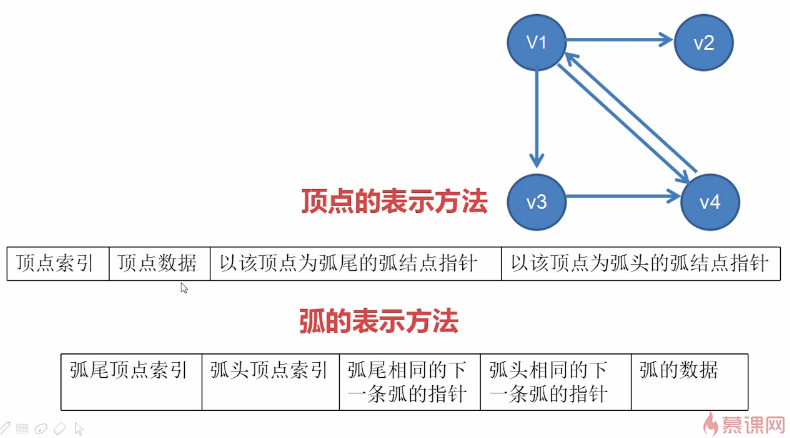
     
   4. **邻接多重表（无向图）**
     > 使用顶点以及边的连接指向来储存数据
     
     

- ### 图的遍历
    > 一个图形G=(V,E)，存在某一个顶点e属于V，我们希望从V开始，通过此节点相邻的节点而去访问G中其他节点，这成为"图形遍历"
    
    
   
    - **深度优先**

     规则：顺着一个顶点不断向下搜索，当搜索到的顶点与前面搜索过的顶点形成环的时候就停止有点类似树的前序遍历
       
     对于上图
     
     从A顶点开始进行深度优先搜索的顺序为：
     
     A - B - C - E - F - D - G - H
     
     丢弃了 F - B , H -D 这两条边，形成了一棵树
     
     ```java
     class Node 
     {
     	int x;
     	Node next;
     	public Node(int x)
     	{
     		this.x=x;
     		this.next=null;
     	}
     }
     class GraphLink
     {
     	public Node first;
     	public Node last;
     	public boolean isEmpty()
     	{
     		return first==null;
     	}
     	public void print()
     	{
     		Node current=first;
     		while(current!=null)
     		{
     			System.out.print("["+current.x+"]");
     			current=current.next;
     			
     		}
     		System.out.println();
     	}
     	public void insert(int x)
     	{
     		Node newNode=new Node(x);
     		if(this.isEmpty())
     		{
     			first=newNode;
     			last=newNode;
     		}
     		else
     		{
     			last.next=newNode;
     			last=newNode;
     		}
     	}
     }
     
     public class CH07_04
     {	
     	public static int run[]=new int[9];
     	public static GraphLink Head[]=new GraphLink[9];		
     	public static void dfs(int current)             //深度优先遍历子程序
     	{
     		run[current]=1;
     		System.out.print("["+current+"]");
     		
     		while((Head[current].first)!=null)
     		{
     			if(run[Head[current].first.x]==0) //如果顶点尚未遍历，就进行dfs的递归调用
     				dfs(Head[current].first.x);
     			Head[current].first=Head[current].first.next;
     		}
     	}
     	public static void main (String args[])
     	{
     		int Data[][] =		//图形边线数组声明
     
     			{ {1,2},{2,1},{1,3},{3,1},{2,4},{4,2},{2,5},{5,2},{3,6},{6,3},
     		      {3,7},{7,3},{4,5},{5,4},{6,7},{7,6},{5,8},{8,5},{6,8},{8,6} };
     		int DataNum;			
     		int i,j;				
     		System.out.println("图形的邻接表内容："); //打印图形的邻接表内容
     		for ( i=1 ; i<9 ; i++ )			    //共有8个顶点
     		{
     			run[i]=0;			    //设定所有顶点成尚未遍历过
     			Head[i]=new GraphLink();	
     			System.out.print("顶点"+i+"=>");
     				for( j=0 ; j<20 ;j++)		    //二十条边线
     				{
     					if(Data[j][0]==i)  //如果起点和列表首相等，则把顶点加入列表
     				{
     					DataNum = Data[j][1];
     					Head[i].insert(DataNum);
     				}
     			}
     			Head[i].print();           //打印图形的邻接表内容
     		}		
     		System.out.println("深度优先遍历顶点：");   //打印深度优先遍历的顶点
     		dfs(1);
     		System.out.println("");
     	}
     }
     ```
     
    - **广度优先**
    规则： 按层来不断进行搜索
    
    对于上图
    
    从A顶点开始进行广度优先搜索的顺序为：
    
    A - B - D - C - F - G - H - E
    
    丢弃了E - F 和 G - H 这两条边，形成了一棵树
    
    ```java
    class Node {
       int x;
       Node next;
       public Node(int x) {
          this.x=x;
          this.next=null;
       }
    }
    class GraphLink {
       public Node first;
       public Node last;
       public boolean isEmpty() {
          return first==null;
       }
       public void print() {
          Node current=first;
          while(current!=null) {
             System.out.print("["+current.x+"]");
    	 current=current.next;
          }
          System.out.println();
       }
       public void insert(int x) {
          Node newNode=new Node(x);
          if(this.isEmpty()) {
             first=newNode;
    	 last=newNode;
          }
          else {
    	 last.next=newNode;
    	 last=newNode;
          }
       }
    }
    public class CH07_05 {	
       public static int run[]=new int[9];//用来记录各顶点是否遍历过
       public static GraphLink Head[]=new GraphLink[9];	
       public final static int MAXSIZE=10; //定义队列的最大容量	
       static int[] queue= new int[MAXSIZE];//队列数组的声明
       static int front=-1; //指向队列的前端
       static int rear=-1; //指向队列的后端
       //队列数据的存入
       public static void enqueue(int value) {
          if(rear>=MAXSIZE) return;
          rear++;
          queue[rear]=value;
       }
       //队列数据的取出
       public static int dequeue() {
          if(front==rear) return -1;
          front++;
          return queue[front];
       }
       //广度优先搜索法
       public static void bfs(int current) {
          Node tempnode; //临时的节点指针
          enqueue(current); //将第一个顶点存入队列
          run[current]=1; //将遍历过的顶点设定为1
          System.out.print("["+current+"]"); //打印该遍历过的顶点
          while(front!=rear) { //判断目前是否为空队列
             current=dequeue(); //将顶点从队列中取出
             tempnode=Head[current].first; //先记录目前顶点的位置
             while(tempnode!=null) {
                if(run[tempnode.x]==0) {
                   enqueue(tempnode.x);
                   run[tempnode.x]=1; //记录已遍历过
                   System.out.print("["+tempnode.x+"]");
                }
    	    tempnode=tempnode.next;
             }
          }
       }
       public static void main (String args[]) {
          int Data[][] =  //图形边线数组声明
          { {1,2},{2,1},{1,3},{3,1},{2,4},{4,2},{2,5},{5,2},{3,6},{6,3},
          {3,7},{7,3},{4,5},{5,4},{6,7},{7,6},{5,8},{8,5},{6,8},{8,6} };
          int DataNum;			
          int i,j;				
          System.out.println("图形的邻接表内容："); //打印图形的邻接表内容
          for( i=1 ; i<9 ; i++ ) { //共有八个顶点
        	  run[i]=0; //设定所有顶点成尚未遍历过
    		 Head[i]=new GraphLink();	
    		 System.out.print("顶点"+i+"=>");
    		 for( j=0 ; j<20 ;j++) {
    		    if(Data[j][0]==i) { //如果起点和表头相等，则把顶点加入表
    		       DataNum = Data[j][1];
    		       Head[i].insert(DataNum);
    		    }
    		 }
    		 Head[i].print();  //打印图形的邻接表内容
          }		
          System.out.println("广度优先遍历顶点：");   //打印广度优先遍历的顶点
          bfs(1);
          System.out.println("");
       }
    }
    ```
- ## 生成树

  > 一个图形的生成树以最少的边来连接图形中所有的顶点，且不造成回路的树状结构。
 
  - **生成树的特点**
  
    > 假设图形G=(V,E)将所有的边分为两个集合T(访问经过的边)及B(访问未经过的边),令S=(V,T)为图形G的生成树
    
    1. E=T+B 
    2. 将集合B的任一边加入集合T中，就会造成回路
    3. V中任意两个顶点V1和V2，在生成树S中存在唯一的一条简单路径。
    
  - **MST生成树(最小生成树)**
  
    > 当遍历的时候涉及边的权值问题，就要使用最小生成树来解决

   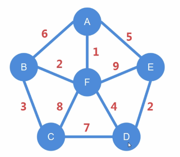
   
    如图：上面的数值是边的权值，可以理解为修路的成本，每个顶点可以理解为一个城市，如何最节约成本完成城市之间的连通就需要使用最小生成树。
    最小生成树后：
    
    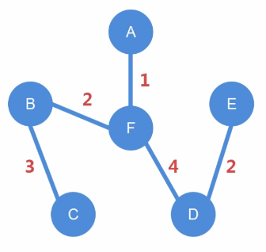
    
  - **普里姆算法（Prim）求MST**
  
   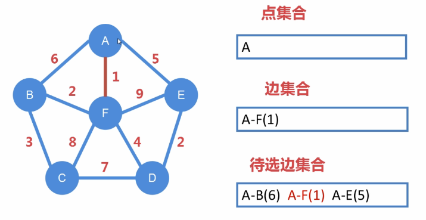
   
   ```
   过程：
      选定一个点A，放入点集合
      关于A的所有的边放入 待选边集合
      从待选边集合选取权值最小的边 A - F (1)，放入边集合
      边集合中提取出未在点集合的点F，放入点集合
      刷新待选边集合，列出所有A和F有关的边
      选出权值最小且不会与当前已选边形成闭环的边，然后放入边集合
      以此类推，得出所有边，既是最小生成树
   ```
   结果：
   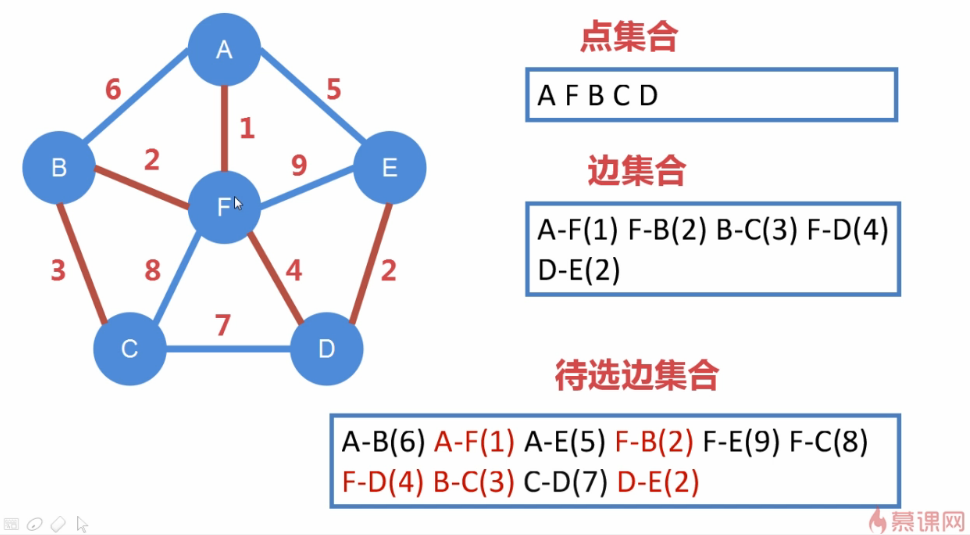
   
   - **克鲁斯卡尔算法（Kruskal）求MST**
   
   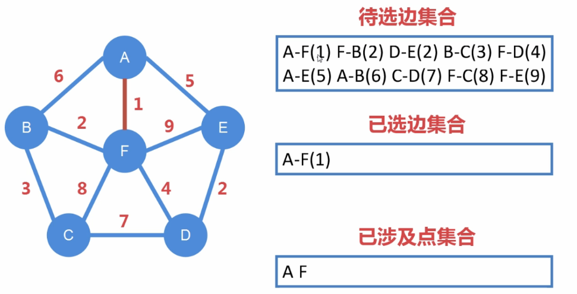
   
    ```
     过程：
     
     列出所有边的集合
     依次选取权值最小的边，同时将涉及的点加入点集合
     选取的边不能与已选边构成闭合
     当点集合中出现了所有点以后，需要让所有点能连通，形成生成树（边 = 点 - 1）
    ```
      
    结果：
     
    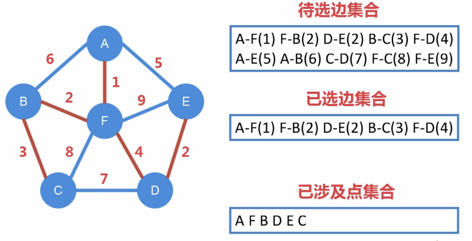
    
    ```java
    public class CH07_06
    {	
    	public static int VERTS=6;
    	public static int v[]=new int[VERTS+1];
    	public static Node NewList = new Node();	
    	public static int findmincost()
    	{
    		int minval=100;
    		int retptr=0;
    		int a=0;
    		while(NewList.Next[a]!=-1)
    		{
    			if(NewList.val[a]<minval && NewList.find[a]==0)
    			{
    				minval=NewList.val[a];
    				retptr=a;
    			}
    			a++;
    		}
    		NewList.find[retptr]=1;
    		return retptr;
    	}
    	public static void mintree()
    	{
    		int i,result=0;
    		int mceptr;
    		int a=0;
    		for(i=0;i<=VERTS;i++)
    			v[i]=0;
    		while(NewList.Next[a]!=-1)
    		{
    			mceptr=findmincost();
    			v[NewList.from[mceptr]]++;
    			v[NewList.to[mceptr]]++;
    			if(v[NewList.from[mceptr]]>1 && v[NewList.to[mceptr]]>1)
    			{
    				v[NewList.from[mceptr]]--;
    				v[NewList.to[mceptr]]--;
    				result=1;
    			}
    			else
    				result=0;
    			if(result==0)
    			{
    				System.out.print("起始顶点["+NewList.from[mceptr]+"]  终止顶点[");
    				System.out.print(NewList.to[mceptr]+"]  路径长度["+NewList.val[mceptr]+"]");
    				System.out.println("");			
    			}
    			a++;
    		}
    	}
    	public static void main (String args[])
    	{
    		int Data[][] =			/*图形数组声明*/
    
    			{ {1,2,6},{1,6,12},{1,5,10},{2,3,3},{2,4,5},
    		      {2,6,8},{3,4,7},{4,6,11},{4,5,9},{5,6,16} };
    		int DataNum;			
    		int fromNum;		
    		int toNum;		
    		int findNum;
    		int Header = 0;			
    		int FreeNode;			
    		int i,j;			
    		System.out.println("建立图形表：");
    		/*打印图形的邻接表内容*/
    		for ( i=0 ; i<10 ; i++ )
    		{
    			for( j=1 ; j<=VERTS ;j++)
    			{
    				if(Data[i][0]==j)
    				{
    					fromNum = Data[i][0];
    					toNum = Data[i][1];
    					DataNum = Data[i][2];
    					findNum=0;
    					FreeNode = NewList.FindFree();
    					NewList.Create(Header,FreeNode,DataNum,fromNum,toNum,findNum);
    				}
    			}
    		}				
    		NewList.PrintList(Header);
    		System.out.println("建立最小成本生成树");	
    		mintree();
    	}
    }
    class Node
    {
    	int MaxLength = 20;			// 定义链表最大长度
    	int from[] = new int[MaxLength];	
    	int to[] = new int[MaxLength];	
    	int find[] = new int[MaxLength];	
    	int val[] = new int[MaxLength];	
    	int Next[] = new int[MaxLength];	// 链表的下一个节点位置
    	
    	public Node ()				// Node构造函数
    	{
    		for ( int i = 0 ; i < MaxLength ; i++ )
    			Next[i] = -2;		// -2表示未用节点
    	}
    // ---------------------------------------------------
    // 搜索可用节点位置
    // ---------------------------------------------------	
    	public int FindFree()
    	{
    		int	i;
    
    		for ( i=0 ; i< MaxLength ; i++ )
    			if ( Next[i] == -2 )
    				break;
    		return i;
    	}
    
    // ---------------------------------------------------
    // 建立链表
    // ---------------------------------------------------	
    	public void Create(int Header,int FreeNode,int DataNum,int fromNum,int toNum,int findNum)
    	{
    		int Pointer;			// 现在的节点位置
    
    		if ( Header == FreeNode )	// 新的链表
    		{	
    			val[Header] = DataNum;	// 设定数据编号
    			from[Header]=fromNum;
    			find[Header]=findNum;
    			to[Header]=toNum;
    			Next[Header] = -1;	// 下个节点的位置，-1表示空节点
    		}
    		else
    		{			
    			Pointer = Header;	// 现在的节点为头节点
    			val[FreeNode] = DataNum;// 设定数据编号
    			from[FreeNode]=fromNum;
    			find[FreeNode]=findNum;
    			to[FreeNode]=toNum;
    									// 设定数据名称
    			Next[FreeNode] = -1;	// 下个节点的位置，-1表示空节点
    									// 找寻链表尾端
    			while ( Next[Pointer] != -1)
    				Pointer = Next[Pointer];
    
    							// 将新节点串连在原表尾端
    			Next[Pointer] = FreeNode;	
    		}
    	}
    // ---------------------------------------------------
    // 打印链表数据
    // ---------------------------------------------------	
    	public void PrintList(int Header)
    	{
    		int	Pointer;		
    		Pointer = Header;
    		while ( Pointer != -1 )
    		{
    			System.out.print("起始顶点["+from[Pointer]+"]  终止顶点[");
    			System.out.print(to[Pointer]+"]  路径长度["+val[Pointer]+"]");
    			System.out.println("");			
    			Pointer = Next[Pointer];
    		}
    	}	
    }
    ```