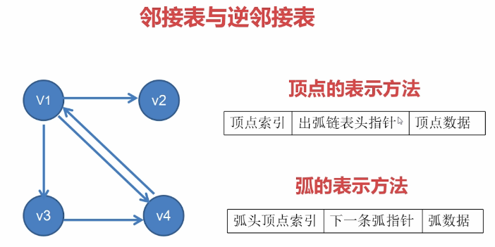
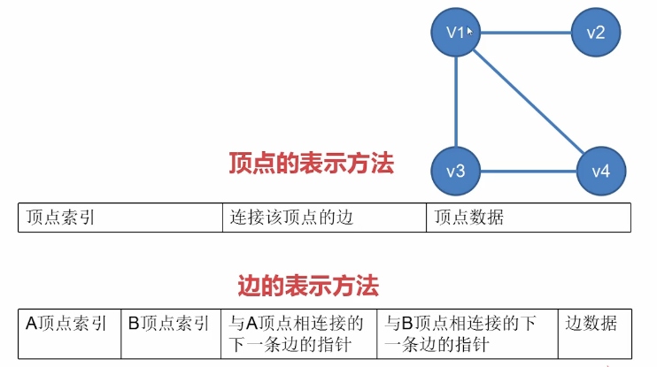

- #### 图的定义

  图是由顶点的有穷非空集合和顶点之间边的集合组成。
  通常表示为：G（V，E）。其中，G表示一个图，V是图G中顶点的集合，E是图G中边的集合。

- #### 图相关概念
  
  1. 无向图(图中任意两个顶点的边都是无向边)
    
    

  2. 有向图(图中任意两个顶点的边都是有向边)
  
    
    
  3. 度： 在无向图中，一个顶点所拥有的总数为度。
  
  4. 入/出度： 在有向图中，以该顶点为终点的变数称为入度，为起点则为出度。
  
  5. 路径长度：路径上包含边的数量称为路径长度。
  
  6. 完全图：边数 = 顶点数 *（ 顶点数 - 1 ） / 2
  
  7. 生成树 ： 边数 = 顶点数 - 1
  
  8. 连通图：当任意一个结点都能直接或间接到其他全部结点的时候，就称为连通图

- #### 图的存储方式
  
   1. **邻接矩阵法**
      > 使用数组的形式来储存数据
      
      - 在无向图中，边是相当于两个顶点相互指向
        
        
        
        ```java
        public    class CH07_01
        {
        public static void main(String args[]) throws IOException
           {  
        	int [][] data={{1,2},{2,1},{1,5},{5,1}, //图形各边的起点值及终点值
        					{2,3},{3,2},{2,4},{4,2},
        					{3,4},{4,3},{3,5},{5,3},
        					{4,5},{5,4}};
        	//声明矩阵arr
        	int arr[][] =new int[6][6];
        	int i,j,k,tmpi,tmpj;            
        	
        	for (i=0;i<6;i++)          //把矩阵清零
        		for (j=0;j<6;j++)
        			arr[i][j]=0;
        	for (i=0;i<14;i++)         //读取图形数据
        		for (j=0;j<6;j++)      //填入arr矩阵
        			for (k=0;k<6;k++)
        			{  
        				tmpi=data[i][0];    //tmpi为起始顶点
        				tmpj=data[i][1];    //tmpj为终止顶点
        				arr[tmpi][tmpj]=1;  //有边的点填入1
        			}
        	System.out.print("无向图形矩阵：\n");
        	for (i=1;i<6;i++)
        	{  
        		for (j=1;j<6;j++)
        	    System.out.print("["+arr[i][j]+"] ");   //打印矩阵内容
        		System.out.print("\n");
        	}
           }
        }

        ```
        
      - 在有向图中，当一个顶点能够指向另外一个顶点，则矩阵中的值为1，否则为0
      
        
        
        ```java
        public    class CH07_02
        {
        public static void main(String args[]) throws IOException
           {  
        		int arr[][]=new int[5][5];  //声明矩阵arr
        		int i,j,tmpi,tmpj;     
        		int [][] data={{1,2},{2,1},{2,3},{2,4},{4,3}};  //图形各边的起点值及终点值
        		for (i=0;i<5;i++)           //把矩阵清零
        			for (j=0;j<5;j++)
        				arr[i][j]=0;
        		for (i=0;i<5;i++)       //读取图形数据
        			for (j=0;j<5;j++)   //填入arr矩阵
        			{  
        				tmpi=data[i][0];     //tmpi为起始顶点
        				tmpj=data[i][1];     //tmpj为终止顶点
        				arr[tmpi][tmpj]=1;   //有边的点填入1
        			}
        		System.out.print("有向图形矩阵：\n");
        	for (i=1;i<5;i++)
        	{  
        		for (j=1;j<5;j++)
        	    System.out.print("["+arr[i][j]+"] ");   //打印矩阵内容
        		System.out.print("\n");
        	}
           }
        }
        ```
        
   2. **相邻表法**
     > 使用顶点以及其弧的指向来储存数据。一个顶点使用一个表。
     
     
     
     ```java
     class Node 
     {
     	int x;
     	Node next;
     	public Node(int x)
     	{
     		this.x=x;
     		this.next=null;
     	}
     }
     class GraphLink
     {
     	public Node first;
     	public Node last;
     	public boolean isEmpty()
     	{
     		return first==null;
     	}
     	public void print()
     	{
     		Node current=first;
     		while(current!=null)
     		{
     			System.out.print("["+current.x+"]");
     			current=current.next;
     		}
     		System.out.println();
     	}
     	public void insert(int x)
     	{
     		Node newNode=new Node(x);
     		if(this.isEmpty())
     		{
     			first=newNode;
     			last=newNode;
     		}
     		else
     		{
     			last.next=newNode;
     			last=newNode;
     		}
     	}
     }
     public class CH07_03
     {	
     	public static void main (String args[])throws IOException
     	{
     		int Data[][] =		//图形数组声明
     
     			{ {1,2},{2,1},{1,5},{5,1},{2,3},{3,2},{2,4},
     		      {4,2},{3,4},{4,3},{3,5},{5,3},{4,5},{5,4} };
     		int DataNum;			
     		int i,j;				
     		System.out.println("图形(a)的邻接表内容：");
     		GraphLink Head[] = new GraphLink[6];		  
     		for ( i=1 ; i<6 ; i++ )
     		{
     			Head[i]=new GraphLink();
     			System.out.print("顶点"+i+"=>");
     			for( j=0 ; j<14 ;j++)
     			{
     				if(Data[j][0]==i)
     				{
     					DataNum = Data[j][1];
     					Head[i].insert(DataNum);
     				}
     			}
     			Head[i].print();
     		}		
     	}	
     }
     ```
     
   | 表示方法 | 优点 | 缺点 |
   | :-------------- | :------------ | :------------ |
   | 相邻矩阵法    | 1.实现简单 2.计算度相当方便 3.要在图形中加入新边时容易 | 1.如果顶点和顶间的路径不多时，易造成稀疏矩阵而浪费空间 2. 计算所有顶点的分支度时，时间复杂度为O(n^2)|
   | 相邻表法    | 1. 相比节省空间  2.计算所有点度时，复杂度为O(n+e)| 1.要求入度时，必须先求其反转表 2.图形新边插入或删除会改动到相关的表链接，较为麻烦费时 |
   
   3. **十字链表（有向图）**
     > 使用顶点以及其弧的指向来储存数据
     
     
     
   4. **邻接多重表（无向图）**
     > 使用顶点以及边的连接指向来储存数据
     
     