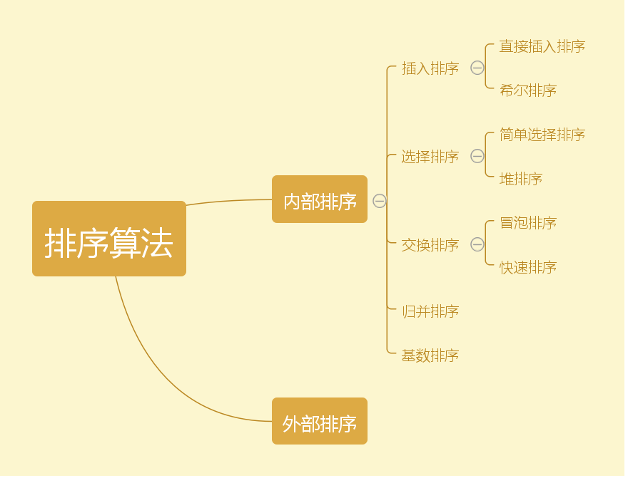
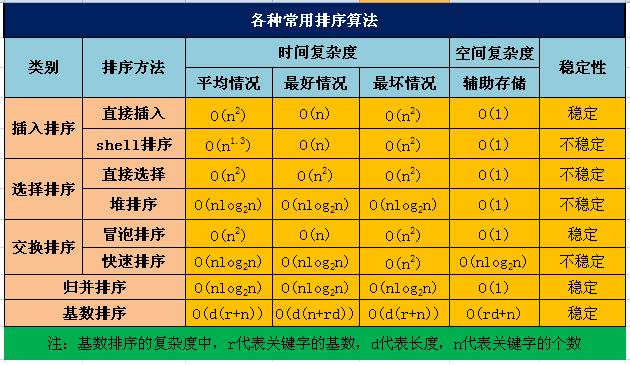
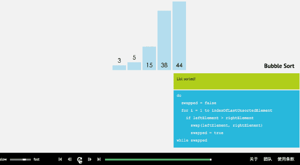
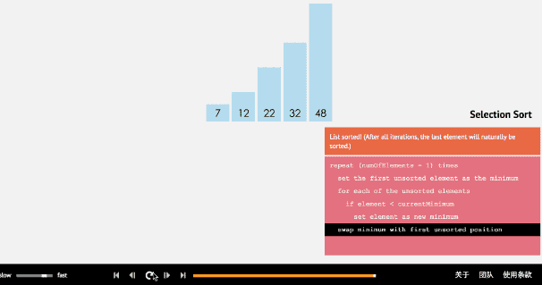
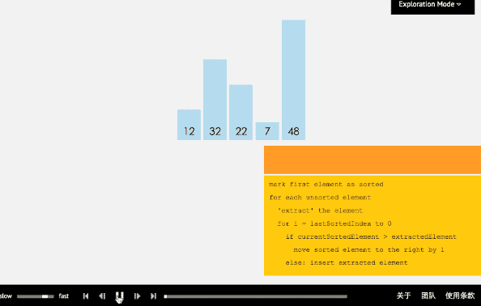
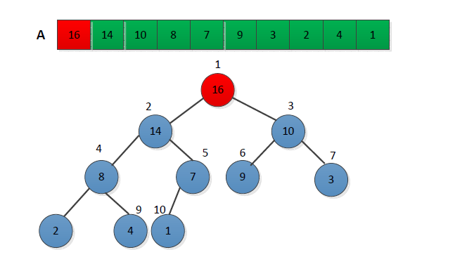
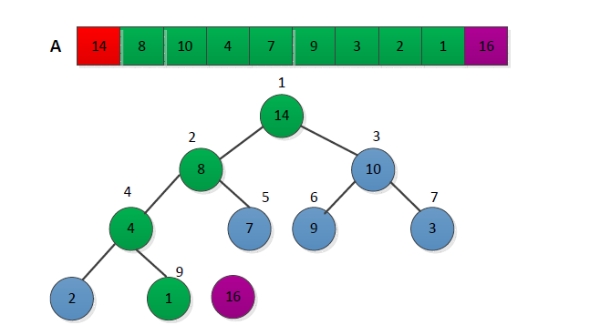
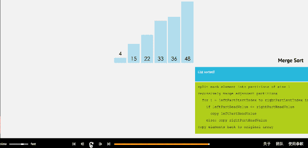
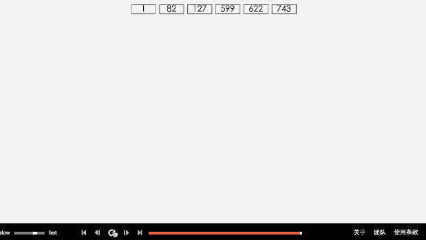

# 排序

- ###　移动方式

  1. **直接移动**： 直接交换存储数据的位置。

  2. **逻辑移动**：不会移动数据的位置，仅改变指向这些数据的值。

- ### 排序的分类

  1. **内部排序**：排序的数据量小，可以完全在内存进行排序。

  2. **外部排序**：排序的数据量无法直接在内存中进行排序，而必须使用辅助存储器。

  常见的内部排序有：冒泡排序，选择排序，插入排序，合并排序，快速排序，堆积排序，
  希尔排序，基数排序等。

  常见的外部排序有：直接合并排序，k路合并，多相合并等

  

- ### 排序算法的选择
  大约可以考虑一下三种因素。
  - **是否稳定**

    稳定的排序是指数据在经过排序后，两个相同键值的数据仍保持原来的数据。

    ```
    原始数据顺序：  7(左)  2   9   7(右) 6
    稳定的排序：    2    6  7(左) 7(右) 9
    不稳定的排序：  2    6  7(右) 7(左) 9
    ```

  - **时间复杂度**

  - **空间复杂度**

  

- ### 冒泡排序

  > 适用于数据量较小且有部分数据已经经过排序的情况。

  ```
  步骤:
  1. 将序列当中的左右元素依次比较，保证右边的元素始终大于左边的元素。
  2. 对序列当中剩下的n-1个元素再次执行步骤1。
  3. 对于长度为n的序列，一共需要执行n-1轮比较

  简单来说，第一次确定最大值，第二次确定第二大置，依次完成排序。
  ```

  

  ```java
  public class Main {
      public static void main(String args[]){
          int[] array=new int[]{6,5,8,4,36,78,9,46,2,5,0,7};
          for (int i: bubbleSort(array)){
              System.out.print(i+" ");
          }
      }
      public static int[] bubbleSort(int[] array){
        if (array==null || array.length<1){
            return null;
        }
        for(int i=0;i<array.length;i++){
            for (int j=1;j<array.length-i;j++){
                if (array[j]<array[j-1]){
                    int temp=array[j];
                    array[j]=array[j-1];
                    array[j-1]=temp;
                }
            }
        }
        return array;
      }
  }
  ```

- ### 简单选择排序

  > 适用于数据量较小且有部分数据已经经过排序的情况。

  ```
  步骤：
  1. 从待排序序列中，找到关键字最小的元素；
  2. 如果最小元素不是待排序序列的第一个元素，将其和第一个元素互换；
  3. 从余下的 N - 1 个元素中，找出关键字最小的元素，重复(1)、(2)步，直到排序结束。
  ```

   

  ```java
  public class Main {
      public static void main(String args[]){
          int[] array=new int[]{6,5,8,4,36,78,9,46,2,5,0,7};
          for (int i: simpleSelectionSort(array)){
              System.out.print(i+" ");
          }
      }
      public static int[] simpleSelectionSort(int[] array){
         for(int j=0;j<array.length;j++) {
             int min=j;
             for (int i = j; i < array.length; i++) {
                 if (array[min] > array[i]) {
                     min = i;
                 }
             }
             int temp = array[j];
             array[j] = array[min];
             array[min] = temp;
         }
         return array;
      }
  }
  ```
- ## 直接插入排序

  > 适用于大部分数据已经经过排序或已排序的数据库新增数据后进行排序的情况。只需要一个额外空间，空间复杂度最佳；
    会造成数据大量的迁移，宜使用链表实现。

   ```
   步骤：
  每次将一个待排序的记录，按其关键字大小插入到前面已经排好序的子序列中的适当位置，直到全部插入完成。
  设数组为a[0...n-1]
  1. 初始时，a[0]自成一个有序区，无序区为a[1...n-1]。令i=1
  2. 将a[i]并入当前有序区a[0...i-1]中形成a[0...i]的有序区间
  3. i++重复第二步直到i==n-1。排序完成
   ```

  

  ```java
  public class Main {
      public static void main(String args[]){
      }
      public static int[] insertSort(int[] array){
          if(array==null||array.length<1){
              return null;
          }
          if (array.length==1){
              return array;
          }
          for (int i = 1; i < array.length; i++) {
              if (array[i] < array[i - 1]) { // 如果i > i-1的话就不需要移动了
                  int tmp = array[i]; // 暂存i的值
                  int j;
                  for (j = i - 1; j >= 0 && array[j] > tmp; j--) { // 从0到i-1，如果0到i-1有大于i的数，全部后移
                      array[j + 1] = array[j];
                  }
                  array[j + 1] = tmp; // 将i的值 插入到当前位置
              }
          }
          return array;
      }
  }

  ```

- ## 希尔排序

  > 适用于大部分数据已完成排序的情况

  ```
  步骤：
  1. 对一个数组长度为N的数组，取一个小于N的整数gap(gap称为步长)
  2. 根据该步长将数组分为若干个子数组，所有距离为gap的倍数的记录放在同一个子数组
  3. 对每个子数组进行插入排序
  4. 然后缩减gap的值，并重复上面的分组和排序
  5. 当gap==1时，整个数组就是有序的
  ```
  

  (参考：http://haoran-10.iteye.com/blog/2266811)

  下面以数列{80,30,60,40,20,10,50,70}为例，演示它的希尔排序过程：

   **第1趟：(gap=4)**

   ```
   当gap=4时,意味着将数列分为4个组：
   {80,20},{30,10},{60,50},{40,70}。 对应数列： {80,30,60,40,20,10,50,70}
   对这4个组分别进行排序，排序结果：
   {20,80},{10,30},{50,60},{40,70}。 对应数列： {20,10,50,40,80,30,60,70}
   ```

   

   **第2趟：(gap=2)**

   ```
   当gap=2时,意味着将数列分为2个组：
   {20,50,80,60}, {10,40,30,70}。 对应数列： {20,10,50,40,80,30,60,70}
   注意：{20,50,80,60}实际上有两个有序的数列{20,80}和{50,60}组成。
        {10,40,30,70}实际上有两个有序的数列{10,30}和{40,70}组成。
   对这2个组分别进行排序，排序结果：
   {20,50,60,80}, {10,30,40,70}。 对应数列： {20,10,50,30,60,40,80,70}
   ```

    

   **第3趟：(gap=1)**

   ```
   当gap=1时,意味着将数列分为1个组：{20,10,50,30,60,40,80,70}
   注意：{20,10,50,30,60,40,80,70}实际上有两个有序的数列{20,50,60,80}和{10,30,40,70}组成。
   对这1个组分别进行排序，排序结果：{10,20,30,40,50,60,70,80}
   ```

   

   ```java
   public class Main {
       public static void main(String args[]){
           int[] array=new int[]{6,5,8,4,36,78,9,46,2,5,0,7};
           for (int i: shellSort(array)){
               System.out.print(i+" ");
           }
       }

       public static int[] shellSort(int[] a){
           if(a==null || a.length<1){
               return null;
           }
           int n = a.length;
           for(int gap=n/2; gap>0; gap /=2){
               for(int i=0; i<gap; i++){
                   for(int j=i+gap; j<n; j+=gap){
                       int temp = a[j];
                       for(int k=j-gap; k>=0&&a[k]>temp;k-=gap){
                           a[k+gap] = a[k];
                           a[k] = temp;
                       }
                   }
               }
           }
           return a;
       }
   }

   ```

- ## 堆排序
  
  > 在任何情况下，时间复杂度都是O(nlogn)，不稳定，空间复杂度为O(1)。利用堆积树完成排序，堆积树分为最大堆积树和最小堆积树两种。

  **最大堆积树满足条件：**
  - 是完成二叉树
  - 所有节点的值均大于或等于它左右子节点的值
  - 树根是堆积树种最大的
  
  **最小堆积树满足条件：**
  - 是完成二叉树
  - 所有节点的值都大于或等于它左右子节点的值
  - 树根是堆积树中最小的
  
  **实现步骤：**
  1. 首先将序列构建称为大顶堆。(所以根节点最大)
   
  
  2. 取出当前大顶堆的根节点，将其与序列末尾元素进行交换.(此时序列末尾值最大)
  3. 对交换后的n-1个序列元素进行调整，使其满足大顶堆的性质。
   
   
  4. 重复2.3步骤，直至堆中只有1个元素为止。
  
  ```java
  public class Main {
      public static void sort(int []arr){
          //1.构建大顶堆
          for(int i=arr.length/2-1;i>=0;i--){
              //从第一个非叶子结点从下至上，从右至左调整结构
              adjustHeap(arr,i,arr.length);
          }
          //2.调整堆结构+交换堆顶元素与末尾元素
          for(int j=arr.length-1;j>0;j--){
              swap(arr,0,j);//将堆顶元素与末尾元素进行交换
              adjustHeap(arr,0,j);//重新对堆进行调整
          }
  
      }
      public static void adjustHeap(int []arr,int i,int length){
          int temp = arr[i];//先取出当前元素i
          for(int k=i*2+1;k<length;k*=2){//从i结点的左子结点开始，也就是2i+1处开始
              if(k+1<length && arr[k]<arr[k+1]){//如果左子结点小于右子结点，k指向右子结点
                  k++;
              }
              if(arr[k] >temp){//如果子节点大于父节点，将子节点值赋给父节点（不用进行交换）
                  arr[i] = arr[k];
                  i = k;
              }else{
                  break;
              }
          }
          arr[i] = temp;//将temp值放到最终的位置
      }
      public static void swap(int []arr,int a ,int b){
          int temp=arr[a];
          arr[a] = arr[b];
          arr[b] = temp;
      }
  }
  ```

- ## 归并排序
  
  > 针对已经排好序的两个及以上的文件，经由合并的方式，组成一个大且排好序的文件。最佳，最差平均时间复杂度均为O(nlogn)，空间复杂度为O(n)，是一种稳定排序。
  
  ```
  步骤：
  1. 可以将一组数组分成A,B两组
  2. 依次类推，当分出来的小组只有一个数据时，就可以认为这个小组已经达到了有序
  3. 然后合并相邻的两个小组
  4. 这样先通过递归的分解数组，再合并数组就可以完成 归并排序 。
  ```
  
   
   
  ```java
  public class MergeSort {
  
      public  static int[] mergeSort(int[] a, int left,int right){
          int middle = (left+right)/2;
          if(left<right){
              mergeSort(a,left,middle);
              mergeSort(a,middle+1,right);
              merge(a,left,middle,right); 
          }
          return a;
      }
      public static voidmerge(int[] a ,int left ,int middle,int right){
          int[] temp = new int[right-left+1];
          int i=left;
          int j=middle+1;
          int k=0;
          while(i<=middle&&j<=right){
              if(a[i]<a[j]){
                  temp[k++]=a[i++];
              }
              else{
                  temp[k++]=a[j++];
              }
          }   
          while(i<=middle){
              temp[k++]=a[i++];
          }
          while(j<=right){
              temp[k++]=a[j++];
          }
          for(int m=0;m<temp.length;m++){
              a[left+m] = temp[m];
          }
      }
      
      public static void main(String[] args){
          int[] a={8,99,37,10,51,109};
          mergeSort(a,0,a.length-1);
          for(int i= 0;i<a.length;i++){
              System.out.print(a[i]+",");
          }
      }
  }
  ```

- ## 基数排序
  
  > 所有情况下，时间复杂度均为O(log p k),k为数据最大值；稳定；空间复杂度O(n*p),n为个数，p为数据字符数，n很大，p固定或很小时效率较高。
    通过序列中各个元素的值，对排序的N个元素进行若干趟的“分配”与“收集”来实现排序。
  
  ```
  基数排序的方式可以采用 LSD （Least significant digital）或 MSD （Most significant digital），LSD的排序方式由键值的最右边开始，而MSD则相反，由键值的最左边开始。
  
  步骤：
  1. 将所有待比较数值（正整数）统一为同样的数位长度，数位较短的数前面补零。
  2. 然后，从最低位开始，依次进行一次排序。
  3. 这样从最低位排序一直到最高位排序完成以后，数列就变成一个有序序列。
  ```
  
   
   
  ```java
  public class RadixSort {
  	public static void main(String[] args) {  
  		Integer[] array = new Integer[] { 1200, 292, 121, 72, 233, 44, 12 };  
  		radixSort(array, 10, 4);  
  		System.out.println("排序后的数组：");  
  		print(array);  
  	}  
  	public static void radixSort(Integer []array, int radix, int d){
  		// 临时数组  
  		Integer[] tempArray = new Integer[array.length];  
  		// count用于记录待排序元素的信息,用来表示该位是i的数的个数  
  		Integer[] count = new Integer[radix];  
  		int rate = 1;
  		for (int i = 0; i < d; i++) {  
  			//重置count数组，开始统计下一个关键字  
  			Arrays.fill(count, 0);
  			//将array中的元素完全复制到tempArray数组中  
  			System.arraycopy(array, 0, tempArray, 0, array.length);  
  			//计算每个待排序数据的子关键字  
  			for (int j = 0; j < array.length; j++) {  
  				int subKey = (tempArray[j] / rate) % radix;  
  				count[subKey]++;
  			}  
  			//统计count数组的前j位（包含j）共有多少个数
  			for (int j = 1; j < radix; j++) {  
  				count[j] = count[j] + count[j - 1]; 
  			}  
  			//按子关键字对指定的数据进行排序 ，因为开始是从前往后放，现在从后忘前读取，保证基数排序的稳定性
  			for (int m = array.length - 1; m >= 0; m--) {  
  				int subKey = (tempArray[m] / rate) % radix;  
  				array[--count[subKey]] = tempArray[m]; //插入到第--count[subKey]位，因为数组下标从0开始
  			}  
  			rate *= radix;//前进一位  
  			System.out.print("第" + (i+1) + "次：");
  			print(array);
  		}  
  	}
  	//输出数组===============
  	public static void print(Integer[] array) {  
  		for (int i = 0; i < array.length; i++) {  
  			System.out.print(array[i] + "\t");  
  		}  
  		System.out.println();  
  	}  
  }
  ```
  
- ## 参考
  - http://www.jianshu.com/p/7d037c332a9d
  - http://blog.csdn.net/dream_angel_z/article/details/45251437
  - http://haoran-10.iteye.com/blog/2266811
  - 《图解数据结构-java版》