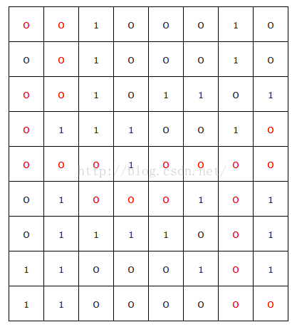

- ### 栈的定义
  > 又称堆栈，是一种特殊的线性表。仅在表的一端进行插入和删除的线性表。
  允许插入、删除的这一端称为栈顶，另一端称为栈底。表中没有元素时称为空栈。
  
- ### 栈的特性
  1. 栈是非常典型的ADT（抽象数据类型），在使用栈时通常是需要明确指定数据类型的。
  2. 后进先出（First-in-last-out）
  3. 只能从站
  
- ### 栈的实现方式
  1. 数组实现：需要一个变量来标记栈顶位置
  2. 链表实现：插入元素时对表头操作需要注意

- ### 堆栈的基本运算
  1. CREATE: 建立一个空堆栈。
  2. PUSH： 存放顶端数据，并返回新堆栈。
  3. POP： 删除顶端数据，并返回新堆栈。
  4. EMPTY： 判断堆栈是否为空堆栈，是则返回true，不是则返回false。
  5. FULL：判断堆栈是否为满。
  
- ### 堆栈的数组实现
  ```java
   public interface Stack<E>{
       Stack<E> push(E e);
       E pop();
       boolean isEmpty();
       boolean isFull();
   }
    public class StackByArray<E> implements Stack<E>,Serializable{
        private static final long serialVersionUID = 7302982918475055337L;
        private Object[] datas;//使用数组存储数据
        transient private int top;//指向数组顶端的索引
        private int maxSize;//堆栈的最大大小
        public StackByArray(int size) {
            this.datas=new Object[size];
            this.maxSize=size;
            top=-1;
        }
        public StackByArray() {
            this(10);//默认数组长度为10
        }
        @Override
        public StackByArray<E> push(E e) {
            if (isFull()){
                System.out.println("This stack is full,can't add elements any more");
                return this;
            }
            datas[++top]=e;
            return this;
        }
        @SuppressWarnings("unchecked")
        @Override
        public E pop() {
            if (isEmpty()){
                System.out.println("This stack is empty null, can't pop any elements");
                return null;
            }
            Object obj=datas[top];
            datas[top--]=null;
            return (E)obj;
        }
        @Override
        public boolean isEmpty() {
            return top == -1;
        }
        @Override
        public boolean isFull() {
            return datas.length >= maxSize;
        }
    }
  ```
  
- ### 堆栈的表实现
   为了方便，在这里直接使用了LinkedList实现
   ```java
   public class StackByList<E> implements Stack<E>,Serializable{
       private static final long serialVersionUID = -5989542299674837023L;
       private LinkedList<E> datas;//使用LinkedList存储元素
       transient private int size;//设置的容量
       public StackByList() {
           this(10);//默认容量
       }
       public StackByList(int size) {
           datas=new LinkedList<>();
           this.size = size;
       }
       @Override
       public StackByList<E> push(E e) {
           if (isFull()){
               System.out.println("This stack is full,can't add elements any more");
           }else{
              datas.add(e);
           }
           return this;
       }
       @Override
       public E pop() {
           if (isEmpty()){
               System.out.println("This stack is empty null, can't pop any elements");
               return null;
           }
           E popElement=datas.getLast();
           datas.removeLast();
           return popElement;
       }
       @Override
       public boolean isEmpty() {
           return datas.isEmpty();
       }
       @Override
       public boolean isFull() {
           return datas.size() >= this.size;
       }
   }
   ```

- ## 堆栈的应用

  堆栈在计算机中应用十分广泛，比如：

  - 二叉树及森林的遍历，如中序遍历，前序遍历等。
  - 计算机CPU的中断处理
  - 算数式转换和求值
  - 编译错误处理
  - 递归调用及返回

  1. **汉诺塔问题**

  > 有三根木桩，第一根上有n个盘子，最底层盘子最大，向上依次变小。将第一根的盘子全部搬到第三根。

  且须要遵守：
  - 每次只能从最上面移动一个盘子；
  - 任何盘子可以从任何木桩搬到其他木桩；
  - 直径较小的盘子必须永远放到较大的盘子之上。
  
  通过分析，可以发现可以分解为3部：
    - 将n-1个盘子从木桩1移动到木桩2；
    - 将木桩1的最大盘子移动到木桩3；
    - 将木桩2的n-1个盘子从木桩2移动到木桩3。
    
  ```java
  public class Hanoi {
      static void hanoi(int n,int p1 ,int p2,int p3){
          if (n==1){
              System.out.println("将木桩"+p1+"的盘子移动到"+p3);// 将木桩1的最大盘子移动到木桩3
          }else {
              hanoi(n - 1, p1, p3,p2); //将n-1个盘子从木桩1移动到木桩2
              System.out.println("将木桩"+p1+"的盘子移动到"+p3);// 将木桩1的最大盘子移动到木桩3
              hanoi(n - 1, p2,p1,p3);//将木桩2的n-1个盘子从木桩2移动到木桩3
          }
      }
  }
  ```
  
  2. **迷宫问题**
  
  > 老鼠放在一个迷宫里，当老鼠走错路就会把一并走过来的路记下来，避免走重复的路，直到走到出口为止。另外在搜索中应判断要
  走的方向，并记录已经走过的路。
  
  在迷宫行走中，必须遵守三个规则：
  - 一次只能走一步，只能上下左右走
  - 遇到墙无法前进时，则退回一步看是否有其他路可以走
  - 走过的路不会走第二次
 
  如下图: 0表示可走，1表示为墙不可走+，从下表(0,0)开始走
  
  
  
  分析：
  可以使用链表记录走过的位置，并将走过位置的数组元素置为2，然后将这个位置放入堆栈后再进行下一次选择。如果走到死巷子，
  就退回去上一个叉路选择其他的路。
  
  ```java
  public class Maze {
      private static int exitX=8;//出口横坐标
      private static int exity=7;//出口纵坐标
      private static int[][] array={
              {0, 0, 1, 0, 0, 0, 1, 0},
              {0, 0, 1, 0, 0, 0, 1, 0},
              {0, 0, 1, 0, 1, 1, 0, 1},
              {0, 1, 1, 1, 0, 0, 1, 0},
              {0, 0, 0, 1, 0, 0, 0, 0},
              {0, 1, 0, 0, 0, 1, 0, 1},
              {0, 1, 1, 1, 1, 0, 0, 1},
              {1, 1, 0, 0, 0, 1, 0, 1},
              {1, 1, 0, 0, 0, 0, 0, 0}
      };
      public static void main(String args[]){
          int x=0,y=0;
          TraceRecord record=new TraceRecord();
          record.push(x,y);
          while(x<=exitX && y<=exity){
              array[x][y]=2;
              if (x>0 && array[x-1][y]==0){
                  x=x-1;
                  record.push(x,y);
              }else if (x<exitX && array[x+1][y]==0){
                  x=x+1;
                  record.push(x,y);
              }else if (y>0 && array[x][y-1]==0){
                  y=y-1;
                  record.push(x,y);
              }else if(y< exity&&array[x][y+1]==0){
                  y=y+1;
                  record.push(x,y);
              }else if (checkExit(x,y)){
                  record.push(x,y);
                  break;
              }else {
                array[x][y]=2;
                record.pop();
                x=record.last.x;
                y=record.last.y;
              }
          }
          Node temp=record.first;
          while (temp.next!=null){
              System.out.print("("+temp.x+","+temp.y+"), ");
              temp=temp.next;
          }
  
      }
      public static boolean checkExit(int x,int y){
         if (x==exitX && y==exity){
             if (array[x-1][y]==1||array[x+1][y]==1||array[x][y-1]==1||array[x][y+1]==2) return true;
             if (array[x-1][y]==1||array[x+1][y]==1||array[x][y-1]==2||array[x][y+1]==1) return true;
             if (array[x-1][y]==1||array[x+1][y]==2||array[x][y-1]==2||array[x][y+1]==1) return true;
             if (array[x-1][y]==2||array[x+1][y]==2||array[x][y-1]==2||array[x][y+1]==1) return true;
         }
         return false;
      }
  }
  class Node{
      int x;
      int y;
      Node next;
  
      public Node(int x, int y) {
          this.x = x;
          this.y = y;
          this.next=null;
      }
  }
  
  class TraceRecord{
      Node first;
      Node last;
      public boolean isEmpty(){
        return first==null;
      }
      public void push(int x,int y){
          Node node=new Node(x,y);
          if (first==null){
              first=node;
              last=node;
          }else {
              last.next=node;
              last=node;
          }
      }
      public void pop(){
          if (isEmpty()){
              System.out.println("栈已空");
              return;
          }
          Node temp=first;
          while (temp.next!=last){
             temp=temp.next;
          }
          temp.next=null;
          last=temp;
      }
  }
  ```
  
- ## 参考
  -《图解数据结构-java版》
  - http://blog.csdn.net/tianyaleixiaowu/article/details/50948031