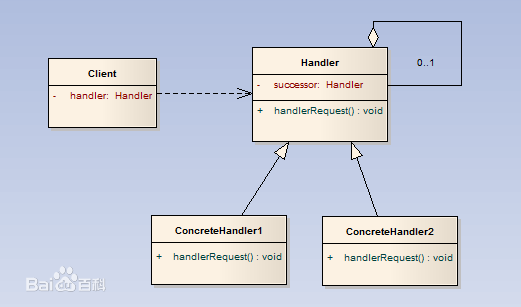

## 责任链模式

> 责任链模式描述的就是如何推卸责任。举例子，有时候，出了某件事，我们去找到A，结果A踢皮球，说这不关我的事，去找B解决，然后我们就去找B，结果B也说，这跟我没关系，快去找C，就这样，我们就被踢来踢去，这就是责任链模式的思想，在找到正确的人解决之前，我们被不断的踢给一个有一个人，就是推卸责任。

---

 


### 1. 抽象处理者角色(Handler)
> 定义出一个处理请求的接口。如果需要，接口可以定义 出一个方法以设定和返回对下家的引用。这个角色通常由一个Java抽象类或者Java接口实现。

```java
public abstract class Handler {  
      
    /** 
     * 持有后继的责任对象 
     */  
    protected Handler successor;  
    /** 
     * 处理请求的方法，
     */  
    public abstract void handleRequest();  
     
    public Handler getSuccessor() {  
        return successor;  
    }  
    /** 
     * 设置后继责任对象 
     */  
    public void setSuccessor(Handler successor) {  
        this.successor = successor;  
    }  
      
}  
```

### 2. 具体处理者角色(ConcreteHandler)
> 具体处理者接到请求后，可以选择将请求处理掉，或者将请求传给下家。由于具体处理者持有对下家的引用，因此，如果需要，具体处理者可以访问下家。

```java
public class ConcreteHandler extends Handler {  
    /** 
     * 处理方法，调用此方法处理请求 
     */  
    @Override  
    public void handleRequest() {  
        
        if(getSuccessor() != null)  
        {              
            System.out.println("放过请求");  
            getSuccessor().handleRequest();              
        }else  
        {              
            System.out.println("处理请求");  
        }  
    }  
  
}  
```
### 3. 客户端
```java
public class Client {  
  
    public static void main(String[] args) {  
        //组装责任链  
        Handler handler1 = new ConcreteHandler();  
        Handler handler2 = new ConcreteHandler();  
        handler1.setSuccessor(handler2);  
        //处理请求  
        handler1.handleRequest();  
    }  
  
}  
```

---

### 优点
- 类之间松耦合
- 分担职责
- 利于重新组织

### 缺点

- 影响性能

### 应用
- javaweb过滤器
- mybatis插件机制

## 参考
- [Java设计模式之责任链模式、职责链模式](http://blog.csdn.net/jason0539/article/details/45091639)
- [设计模式之责任链模式](http://www.jianshu.com/p/198a29556f30?utm_source=tuicool&utm_medium=referral)