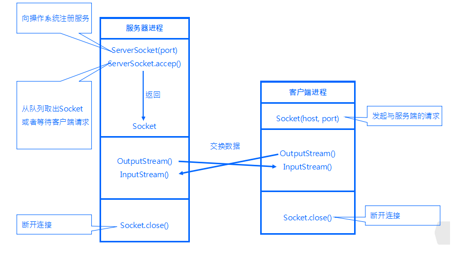

#### 01. 通过HttpServletRequest. getParameter获取的参数.
```
A. 总是采用UTF-8编码
B. 总是采用lS08859-1编码
C. 由客户端浏览器和Web容器配置共同决定编码
D. 由服务器所在的操作系统决定编码

正解: C
解析：1、浏览器根据jsp页面开头声明的编码方式对request中参数编码；
     2、tomcat默认解码是ISO-8859-1， 
     但是我们可以显示指定解码格式通过调用 
     request.setCharacterEncoding("UTF-8")，
     或者修改tomcat的配置文件server.xml中的编码，添加uriEncoding属性。
```

#### 02. 如果希望监听TCP端口9000，应该怎样创建socket?
```
A. new Socket("localhost",9000);
B. new ServerSocket(9000);
C. new Socket(9000);
D. new ServerSocket("localhost",9000);

正解: B
解析： ServerSocket(int port) 是服务端绑定port端口，调accept()监听等待客户端连接，它返回一个连接队列中的一个socket。
      Socket(InetAddress address , int port)是创建客户端连接主机的socket流，其中InetAddress是用来记录主机的类，port指定端口。
```
 
 
#### 03. 下列有关Servlet的生命周期，说法不正确的是？
```
A. 在创建自己的Servlet时候，应该在初始化方法init()方法中创建Servlet实例
B. 在Servlet生命周期的服务阶段，执行service()方法，根据用户请求的方法，执行相应的doGet()或是doPost()方法
C. 在销毁阶段，执行destroy()方法后会释放Servlet 占用的资源
D. destroy()方法仅执行一次，即在服务器停止且卸载Servlet时执行该方法

正解： A
解析： Servlet的生命周期分为5个阶段：加载、创建、初始化、处理客户请求、卸载。
(1)加载：容器通过类加载器使用servlet类对应的文件加载servlet
(2)创建：通过调用servlet构造函数创建一个servlet对象
(3)初始化：调用init方法初始化
(4)处理客户请求：每当有一个客户请求，容器会创建一个线程来处理客户请求
(5)卸载：调用destroy方法让servlet自己释放其占用的资源
并不是在init()方法中创建Servlet实例
```

#### 04.HttpSession session = request.getSession(false) 与HttpSession session = request.getSession(true)的区别？
```
A. 没有区别
B. 如果当前reqeust中的HttpSession 为null，当传入参数为空时，就创建一个新的Session，否则返回null
C. 如果当前reqeust中的HttpSession 为null，当传入参数为true时，就创建一个新的Session，否则返回null

正解：BC
解析：
1、request.getSession() 等价于 request.getSession(true) 
这两个方法的作用是相同的，查找请求中是否有关联的session id，如果有则返回这个号码所对应的session对象，如果没有则生成一个新的session对象。所以说，通过此方法是一定可以获得一个session对象。 
2、request.getSession(false) 查找请求中是否有关联的session id，如果有则返回这个号码所对应的session对象，如果没有则返回一个null。
```

#### 05. 下面属于JSP内置对象的是？
```
A. out对象
B. response对象
C. application对象
D. page对象

正解：ABCD
解析：JSP9大内置对象
   1、pageContext 表示页容器 EL表达式、 标签 、上传 
   2、request 服务器端取得客户端的信息：头信息 、Cookie 、请求参数 ，最大用处在MVC设计模式上 
   3、response 服务器端回应客户端信息：Cookie、重定向 
   4、session 表示每一个用户，用于登录验证上 
   5、application 表示整个服务器 
   6、config 取得初始化参数，初始化参数在web.xml文件中配置 
   7、exception 表示的是错误页的处理操作 
   8、page 如同this一样，代表整个jsp页面自身 
   9、out 输出 ，但是尽量使用表达式输出

```

#### 06. 说一下Servlet的体系结构。
```
所有的Servlet都必须要实现的核心的接口是javax.servlet.Servlet。
每一个Servlet都必须要直接或者是间接实现这个接口，
或者是继承javax.servlet.GenericServlet或者javax.servlet.http.HTTPServlet。
最后，Servlet使用多线程可以并行的为多个请求服务。
```

#### 07. GenericServlet和HttpServlet有什么区别？
```
GenericServlet是一个通用的协议无关的Servlet，
它实现了Servlet和ServletConfig接口。
继承自GenericServlet的Servlet应该要覆盖service()方法。
最后，为了开发一个能用在网页上服务于使用HTTP协议请求的Servlet，
你的Servlet必须要继承自HttpServlet。这里有Servlet的例子。
```

#### 08. 什么是Servlet链(Servlet Chaining)？
```
Servlet链是把一个Servlet的输出发送给另一个Servlet的方法。
第二个Servlet的输出可以发送给第三个Servlet，依次类推。
链条上最后一个Servlet负责把响应发送给客户端。
```

#### 09. 如何知道是哪一个客户端的机器正在请求你的Servlet？
```
ServletRequest类可以找出客户端机器的IP地址或者是主机名。
getRemoteAddr()方法获取客户端主机的IP地址，getRemoteHost()可以获取主机名。
```

#### 10. 什么是服务端包含(Server Side Include)？
```
服务端包含(SSI)是一种简单的解释型服务端脚本语言，大多数时候仅用在Web上，
用servlet标签嵌入进来。SSI最常用的场景把一个或多个文件包含到Web服务器的一个Web页面中。
当浏览器访问Web页面的时候，
Web服务器会用对应的servlet产生的文本来替换Web页面中的servlet标签。
```

#### 11. 解释下Servlet的生命周期，并说出Servlet和CGI的区别。
```
对每一个客户端的请求，Servlet引擎载入Servlet，调用它的init()方法，
完成Servlet的初始化。然后，Servlet对象通过为每一个请求单独调用service()
方法来处理所有随后来自客户端的请求，最后，调用Servlet
(译者注：这里应该是Servlet而不是server)的destroy()方法把Servlet删除掉。

与cgi的区别在于servlet处于服务器进程中，它通过多线程方式运行其service方法，
一个实例可以服务于多个请求，并且其实例一般不会销毁，
而CGI对每个请求都产生新的进程，服务完成后就销毁，所以效率上低于servlet。
```

#### 12. HTTP响应的结构是怎么样的？
```
HTTP响应由三个部分组成：
状态码(Status Code)：描述了响应的状态。可以用来检查是否成功的完成了请求。请求失败的情况下，状态码可用来找出失败的原因。如果Servlet没有返回状态码，默认会返回成功的状态码HttpServletResponse.SC_OK。
HTTP头部(HTTP Header)：它们包含了更多关于响应的信息。比如：头部可以指定认为响应过期的过期日期，或者是指定用来给用户安全的传输实体内容的编码格式。如何在Serlet中检索HTTP的头部看这里。
主体(Body)：它包含了响应的内容。它可以包含HTML代码，图片，等等。主体是由传输在HTTP消息中紧跟在头部后面的数据字节组成的。
```

#### 13. 什么是HTTP隧道？
```
HTTP隧道是一种利用HTTP或者是HTTPS把多种网络协议封装起来进行通信的技术。
因此，HTTP协议扮演了一个打通用于通信的网络协议的管道的包装器的角色。
把其他协议的请求掩盖成HTTP的请求就是HTTP隧道。
```

#### 14. sendRedirect()和forward()方法有什么区别？
```
sendRedirect()方法会创建一个新的请求，而forward()方法只是把请求转发到一个新的目标上。重定向(redirect)以后，
之前请求作用域范围以内的对象就失效了，因为会产生一个新的请求，
而转发(forwarding)以后，之前请求作用域范围以内的对象还是能访问的。
一般认为sendRedirect()比forward()要慢。
```

## 来源或参考：
   - 牛客网